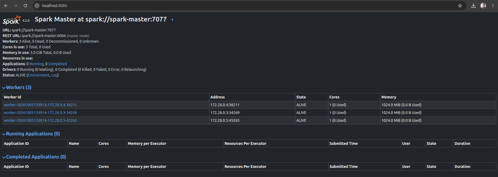
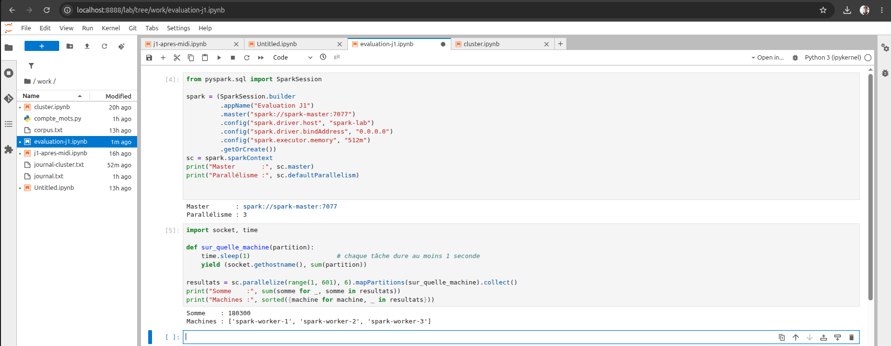
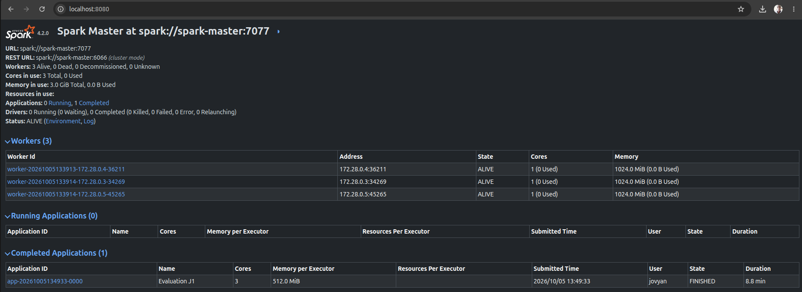
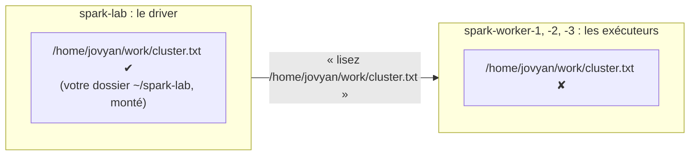

# Correction de l'évaluation : installer un cluster Spark Standalone

> Formation **PySpark – Traitement des données** · Jour 1 après-midi · Évaluation pratique (30 min)
> [Retour au sommaire du dépôt](../../README.md) · Tutoriel complet du cluster : [`spark-cluster`](../spark-cluster/)

Toutes les sorties et les captures de cette page sont **réelles** : elles viennent d'une exécution de l'évaluation, erreurs comprises. Chez vous, les adresses `172.x.x.x`, les ports, les dates et les identifiants d'application seront différents ; tout le reste doit être identique.

Fichiers de ce dossier : [`docker-compose.yaml`](docker-compose.yaml) (la solution de l'étape 1) · [`cluster.txt`](cluster.txt) et [`compte_mots.py`](compte_mots.py) (l'étape 4).

## Sommaire

1. [Étape 1 : décrire et démarrer le cluster (4 pts)](#étape-1--décrire-et-démarrer-le-cluster-4-pts)
2. [Étape 2 : relier spark-lab au cluster (3 pts)](#étape-2--relier-spark-lab-au-cluster-3-pts)
3. [Étape 3 : une application sur le cluster (4 pts)](#étape-3--une-application-sur-le-cluster-4-pts)
4. [Étape 4 : un script spark-submit sur le cluster (3 pts)](#étape-4--un-script-spark-submit-sur-le-cluster-3-pts)
5. [Nettoyer](#nettoyer)
6. [QCM (6 pts)](#qcm-6-pts)
7. [Les erreurs fréquentes, en un tableau](#les-erreurs-fréquentes-en-un-tableau)

### Deux terminaux, deux rôles

Plusieurs erreurs de cette évaluation viennent d'un terminal mal choisi. Regardez **l'invite** avant de taper :

| Commandes | Où les taper | Invite |
|---|---|---|
| `docker …`, `docker compose …` | le terminal **de votre poste**, dans `~/spark-eval` | `vous@votre-poste:~/spark-eval$` |
| `spark-submit …` | **dans `spark-lab`** : terminal JupyterLab, ou `docker exec -it spark-lab bash`, puis `cd ~/work` | `jovyan@<identifiant>:~/work$` |

Le conteneur `spark-lab` ne connaît pas la commande `docker`, et votre dossier `~/spark-lab` y porte le nom `~/work`.

---

## Étape 1 : décrire et démarrer le cluster (4 pts)

**Demandé :** trois workers de **1 cœur et 1 Go** chacun, à côté du master fourni.

### La solution

```yaml
  spark-worker-1:
    image: quay.io/jupyter/pyspark-notebook
    hostname: spark-worker-1
    command: ["/usr/local/spark/bin/spark-class", "org.apache.spark.deploy.worker.Worker", "spark://spark-master:7077"]
    environment:
      SPARK_WORKER_CORES: "1"
      SPARK_WORKER_MEMORY: 1g
      SPARK_WORKER_DIR: /tmp/spark-worker
    depends_on: [spark-master]
    healthcheck:
      disable: true
```

`spark-worker-2` et `spark-worker-3` sont identiques, à leur nom et leur `hostname` près. Le fichier complet : [`docker-compose.yaml`](docker-compose.yaml).

| Ligne | Pourquoi |
|---|---|
| `image:` | La **même image** que `spark-lab` : même Java, même Spark, même Python partout. |
| `hostname: spark-worker-1` | Le nom de machine du conteneur. On le retrouvera à l'étape 3, renvoyé par `socket.gethostname()`. |
| `command: [… "…worker.Worker", "spark://spark-master:7077"]` | Le programme Worker de Spark, **au premier plan** : il devient le programme principal du conteneur. `start-worker.sh` lancerait Java en arrière-plan puis se terminerait, et le conteneur s'arrêterait avec lui. L'argument est l'adresse du master, **par son nom**. |
| `SPARK_WORKER_CORES: "1"`, `SPARK_WORKER_MEMORY: 1g` | Ce que le worker **offre** aux applications. |
| `SPARK_WORKER_DIR` | Où le worker range les journaux de ses exécuteurs. |
| `depends_on`, `healthcheck: disable` | Démarrer après le master ; ne pas utiliser le contrôle de santé de l'image, qui surveille Jupyter, absent ici. |

### Démarrer et vérifier

```bash
$ cd ~/spark-eval
$ docker compose config --services
$ docker compose up -d
$ sleep 10
$ docker compose logs spark-master | grep -iE "starting spark master|elected leader|registering worker"
```

```
spark-master
spark-worker-1
spark-worker-2
spark-worker-3
[+] Running 5/5
 ✔ Network spark-eval_default             Created
 ✔ Container spark-eval-spark-master-1    Started
 ✔ Container spark-eval-spark-worker-3-1  Started
 ✔ Container spark-eval-spark-worker-1-1  Started
 ✔ Container spark-eval-spark-worker-2-1  Started
spark-master-1  | 26/10/05 13:39:13 INFO Master: Starting Spark master at spark://spark-master:7077
spark-master-1  | 26/10/05 13:39:15 INFO Master: I have been elected leader! New state: ALIVE
spark-master-1  | 26/10/05 13:39:15 INFO Master: Registering worker 172.28.0.4:36211 with 1 cores, 1024.0 MiB RAM
spark-master-1  | 26/10/05 13:39:16 INFO Master: Registering worker 172.28.0.5:45265 with 1 cores, 1024.0 MiB RAM
spark-master-1  | 26/10/05 13:39:16 INFO Master: Registering worker 172.28.0.3:34269 with 1 cores, 1024.0 MiB RAM
```

- `config --services` lit le fichier **sans rien démarrer** : 4 noms et aucune erreur, le YAML est valide.
- Le réseau s'appelle **`spark-eval_default`** : le nom du dossier, suivi de `_default`. Il servira à l'étape 2.
- **Trois** lignes `Registering worker … with 1 cores, 1024.0 MiB RAM`. Spark écrit 1 Go en `1024.0 MiB` : il ne passe en GiB qu'à partir de 2 Go.
- L'ordre d'inscription et les adresses varient d'un démarrage à l'autre : on raisonne toujours avec des **noms**.

Sur `http://localhost:8080` :



**Workers: 3 Alive**, **Cores in use: 3 Total**, **Memory in use: 3.0 GiB Total**, et chaque worker à `1 (0 Used)` / `1024.0 MiB (0.0 B Used)`.

### ⚠️ Erreur fréquente : les valeurs de la démonstration

Le fichier de la démonstration offrait 2 cœurs et 2 Go par worker. Recopié sans l'adapter, il démarre sans erreur… mais pas avec le cluster demandé :

```
spark-master-1  | … INFO Master: Registering worker 172.28.0.5:41869 with 2 cores, 2.0 GiB RAM
spark-master-1  | … INFO Master: Registering worker 172.28.0.3:39077 with 2 cores, 2.0 GiB RAM
spark-master-1  | … INFO Master: Registering worker 172.28.0.4:35967 with 2 cores, 2.0 GiB RAM
```

Correction, puis redémarrage complet :

```bash
$ sed -i 's/SPARK_WORKER_CORES: "2"/SPARK_WORKER_CORES: "1"/; s/SPARK_WORKER_MEMORY: 2g/SPARK_WORKER_MEMORY: 1g/' docker-compose.yaml
$ grep -n "SPARK_WORKER_CORES\|SPARK_WORKER_MEMORY" docker-compose.yaml
$ docker compose down
$ docker compose up -d
```

- `sed -i 's/ANCIEN/NOUVEAU/'` remplace dans le fichier, sur place, et pour les trois workers d'un coup.
- **Pourquoi `down` avant `up -d` ?** Un simple `up -d` recréerait les workers modifiés, mais le master se souviendrait des anciens : la page 8080 afficherait « 3 Alive, **3 Dead** » pendant de longues minutes.

**La règle :** relire l'énoncé avant de recopier la démonstration. La vérification est dans le journal du master : `with 1 cores, 1024.0 MiB RAM`.

---

## Étape 2 : relier spark-lab au cluster (3 pts)

```bash
$ docker network connect spark-eval_default spark-lab
$ docker exec spark-lab getent hosts spark-master
172.28.0.2      spark-master
$ docker compose exec spark-worker-3 getent hosts spark-lab
172.28.0.6      spark-lab
```

| Commande | Ce qu'elle vérifie |
|---|---|
| `docker network connect spark-eval_default spark-lab` | Ajoute à `spark-lab` une carte réseau sur le réseau du cluster. Muette quand elle réussit. |
| `spark-lab` → `spark-master` | Le **driver** pourra joindre le master pour demander des exécuteurs. |
| `spark-worker-3` → `spark-lab` | Les **exécuteurs** pourront rappeler le driver pour recevoir leurs tâches. C'est pour ce sens que l'on fixe `spark.driver.host` à l'étape 3. |

- `spark-lab` prend la première adresse libre : le master a la `.2`, les workers `.3` à `.5`, donc `spark-lab` la `.6`.
- `endpoint with name spark-lab already exists` : il était déjà branché, sans gravité.
- **Après un `docker compose down`, le réseau est supprimé** : il faut refaire le `network connect` après le `up -d` suivant.

---

## Étape 3 : une application sur le cluster (4 pts)

### Cellule 1 : la session

```python
from pyspark.sql import SparkSession

spark = (SparkSession.builder
         .appName("Evaluation J1")
         .master("spark://spark-master:7077")
         .config("spark.driver.host", "spark-lab")
         .config("spark.driver.bindAddress", "0.0.0.0")
         .config("spark.executor.memory", "512m")
         .getOrCreate())
sc = spark.sparkContext
print("Master       :", sc.master)
print("Parallélisme :", sc.defaultParallelism)
```

```
Master       : spark://spark-master:7077
Parallélisme : 3
```

| Réglage | Rôle |
|---|---|
| `.master("spark://spark-master:7077")` | Le gestionnaire de ressources : le master Standalone, au lieu de `local[*]`. |
| `spark.driver.host = spark-lab` | Le nom sous lequel le driver s'annonce aux exécuteurs. Sans lui, il s'annoncerait sous l'identifiant du conteneur (`103bc05c4256`). |
| `spark.driver.bindAddress = 0.0.0.0` | Le driver écoute sur toutes ses cartes réseau : `spark-lab` en a deux depuis l'étape 2. |
| `spark.executor.memory = 512m` | La mémoire de chaque exécuteur. Elle doit tenir dans ce qu'offre un worker (1 Go). |

**Vérification bonus :** sur un cluster, `defaultParallelism` vaut le **nombre total de cœurs des exécuteurs inscrits**. **3** prouve que les trois exécuteurs, un par worker, étaient déjà prêts. En `local[*]`, on obtenait le nombre de cœurs du poste.

### Cellule 2 : où a eu lieu le calcul ?

```python
import socket, time

def sur_quelle_machine(partition):
    time.sleep(1)                       # chaque tâche dure au moins 1 seconde
    yield (socket.gethostname(), sum(partition))

resultats = sc.parallelize(range(1, 601), 6).mapPartitions(sur_quelle_machine).collect()
print("Somme    :", sum(somme for _, somme in resultats))
print("Machines :", sorted({machine for machine, _ in resultats}))
```

```
Somme    : 180300
Machines : ['spark-worker-1', 'spark-worker-2', 'spark-worker-3']
```



- La somme de 1 à 600 vaut 600 × 601 / 2 = **180 300**, quel que soit l'endroit où l'on calcule.
- `mapPartitions` applique la fonction à chaque partition **sur l'exécuteur** : `gethostname()` renvoie donc le nom du **worker**. `spark-lab`, où tourne le notebook, n'apparaît jamais : **le driver planifie et collecte, les exécuteurs calculent**.
- 6 tâches d'une seconde sur 3 cœurs : environ 2 secondes. Le `sleep(1)` laisse à chaque exécuteur le temps de recevoir du travail.
- Un worker manque dans la liste ? Son exécuteur n'était pas encore inscrit : réexécutez la cellule.

### La page 8080, puis la cellule 3

```python
spark.stop()
```



| Colonne | Valeur | Ce qu'elle montre |
|---|---|---|
| Name | `Evaluation J1` | le `.appName(…)` |
| **Cores** | **3** | l'application a pris **tous** les cœurs du cluster : sans `spark.cores.max`, une application Standalone prend tout ce qui est libre |
| **Memory per Executor** | **512.0 MiB** | le `spark.executor.memory` |
| Duration | 8.8 min | une application vit de `getOrCreate()` à `spark.stop()`, pas le temps d'un calcul |
| Cores in use (en haut) | 3 Total, **0 Used** | `spark.stop()` a rendu les cœurs |

**Pourquoi `spark.stop()` avant l'étape 4 ?** Tant que la session est ouverte, elle garde les 3 cœurs. Le script de l'étape 4 attendrait indéfiniment, avec le message `Initial job has not accepted any resources` en boucle.

---

## Étape 4 : un script spark-submit sur le cluster (3 pts)

Les cellules 4 et 5 créent [`cluster.txt`](cluster.txt) (192 octets) et [`compte_mots.py`](compte_mots.py) dans `work`.

### La solution

**1. Le fichier doit exister, au même chemin, sur chaque worker.** Dans le terminal **du poste** :

```bash
$ cd ~/spark-eval
$ for w in 1 2 3; do
    docker compose cp ~/spark-lab/cluster.txt spark-worker-$w:/home/jovyan/work/cluster.txt
  done
```

```
 ✔ spark-eval-spark-worker-1-1 copy /home/…/spark-lab/cluster.txt to spark-eval-spark-worker-1-1:/home/jovyan/work/cluster.txt Copied
 ✔ spark-eval-spark-worker-2-1 copy /home/…/spark-lab/cluster.txt to spark-eval-spark-worker-2-1:/home/jovyan/work/cluster.txt Copied
 ✔ spark-eval-spark-worker-3-1 copy /home/…/spark-lab/cluster.txt to spark-eval-spark-worker-3-1:/home/jovyan/work/cluster.txt Copied
```

**2. Le script.** **Dans `spark-lab`**, dans `~/work` :

```bash
jovyan$ cd ~/work
jovyan$ spark-submit \
  --master spark://spark-master:7077 \
  --conf spark.driver.host=spark-lab \
  --conf spark.driver.bindAddress=0.0.0.0 \
  --conf spark.executor.memory=512m \
  compte_mots.py cluster.txt 2>/dev/null
jovyan$ echo $?
```

```
les          6
exécuteurs   4
driver       3
au           2
le           2
0
```

- Les mêmes réglages qu'à l'étape 3, passés en `--conf` au lieu de `.config(…)`. Le script, lui, ne contient **aucun** `.master(…)` : le même fichier tourne en local ou sur le cluster.
- `2>/dev/null` jette le journal de Spark (canal 2) et garde les `print` (canal 1).
- `echo $?` affiche le code de sortie de la commande précédente : **0** = succès.
- `au` et `le` ont autant d'occurrences : le tri `(-nombre, mot)` les range par ordre alphabétique.

### Trois erreurs réelles, et ce qu'elles enseignent

**① `spark-submit` lancé hors de `work` : code de sortie 2**

```
(base) jovyan@103bc05c4256:~$ spark-submit … compte_mots.py cluster.txt 2> journal-cluster.txt
python3: can't open file '/home/jovyan/compte_mots.py': [Errno 2] No such file or directory
code de sortie : 2
```

L'invite se termine par `~$` et non `~/work$` : `docker exec -it spark-lab bash` ouvre le shell dans `/home/jovyan`. Python ne trouve même pas le script ; **Spark n'a pas démarré**. Remède : `cd ~/work`.

**② `docker` tapé dans `spark-lab`**

```
(base) jovyan@103bc05c4256:~/work$ for w in 1 2 3; do docker compose cp ~/spark-lab/cluster.txt spark-worker-$w:/home/jovyan/work/cluster.txt; done
bash: docker: command not found
bash: docker: command not found
bash: docker: command not found
```

La copie vers les workers se fait **depuis le poste** : `exit` pour sortir du conteneur, ou un second terminal. Voir [Deux terminaux, deux rôles](#deux-terminaux-deux-rôles).

**③ Le fichier absent des workers : code de sortie 1**

C'est le piège central de l'étape. Sans la copie :

```
Traceback (most recent call last):
  File "/home/jovyan/work/compte_mots.py", line 14, in <module>
    .sortBy(lambda kv: (-kv[1], kv[0]))
  …
  File "…/pyspark/core/rdd.py", line 1368, in sortByKey
    rddSize = self.count()
  …
org.apache.spark.SparkException: Job aborted due to stage failure: Task 0 in stage 0.0 failed 4 times,
most recent failure: Lost task 0.3 in stage 0.0 (TID 6) (172.28.0.3 executor 1):
java.io.FileNotFoundException: File file:/home/jovyan/work/cluster.txt does not exist
  …
Caused by: java.io.FileNotFoundException: File file:/home/jovyan/work/cluster.txt does not exist
code de sortie : 1
```

Lire une erreur Spark, c'est lire **trois endroits** :

1. **Le haut du traceback** : la ligne de *votre* code. Ligne 14, le `sortBy`, qui lance lui-même un `count()`.
2. **La ligne `SparkException`** : ce qui s'est passé. La tâche a tourné sur un **worker** (`172.28.0.3 executor 1`), a été retentée 4 fois (`0.3` = 4ᵉ tentative), puis le job a été abandonné.
3. **Le dernier `Caused by:`** : la cause. Les lignes `at …` peuvent être ignorées.



Le driver trouve le fichier **chez lui** et le découpe en partitions ; chaque exécuteur ouvre ensuite ce chemin **sur le disque de son worker**, où il n'existe pas. **Sur un cluster, les données doivent être sur un stockage que toutes les machines voient au même chemin** : HDFS (`hdfs:///…`), S3, ADLS ou OneLake. La copie sur chaque worker ne fait qu'imiter ce stockage partagé.

| Code de sortie | Signification |
|---|---|
| **0** | Succès. |
| **1** | Spark a démarré et le cluster a travaillé, mais le job a échoué (ici, la donnée manquait sur les workers). |
| **2** | Python n'a pas pu ouvrir le script : Spark n'a même pas démarré. |

Sur la page 8080, les lancements en échec apparaissent pourtant en `FINISHED`, comme le lancement réussi : pour le master, l'application s'est **terminée** et a rendu ses ressources. La réussite se lit dans le **code de sortie**.

---

## Nettoyer

```bash
$ docker network disconnect spark-eval_default spark-lab
$ cd ~/spark-eval && docker compose down
$ docker stop spark-lab          # demain matin : docker start spark-lab
```

`docker compose down` supprime aussi les copies de `cluster.txt` faites sur les workers.

---

## QCM (6 pts)

| Question | Réponse | Pourquoi |
|---|---|---|
| Combien de cœurs votre application de l'étape 3 a-t-elle obtenus ? | **3** | Un cœur par worker. Sans `spark.cores.max`, une application Standalone prend tous les cœurs libres. |
| Dans l'étape 3, où s'exécutait le driver ? | **Dans `spark-lab`** | C'est le noyau du notebook. La liste de la cellule 2 ne contient que les workers : ce sont les exécuteurs qui calculent. |
| Quel mot arrive en deuxième position, et avec combien d'occurrences ? | **exécuteurs, 4** | Derrière `les` (6), devant `driver` (3). |

---

## Les erreurs fréquentes, en un tableau

| Symptôme | Cause | Remède |
|---|---|---|
| `Registering worker … with 2 cores, 2.0 GiB RAM` | Valeurs de la démonstration recopiées | 1 cœur, `1g` ; `docker compose down` puis `up -d` |
| `config --services` signale une erreur | Indentation YAML (tabulation, niveaux décalés) | 2 espaces par niveau ; workers au même niveau que `spark-master` |
| `port is already allocated` sur 8080 | Un autre cluster tourne déjà | L'arrêter (`docker compose down` dans son dossier) |
| `getent` n'affiche rien | `spark-lab` pas branché sur `spark-eval_default` (ou réseau recréé par un `down`) | `docker network connect spark-eval_default spark-lab` |
| `Master : local[*]` dans la cellule 1 | Une session locale existait déjà dans ce noyau | `spark.stop()`, puis réexécuter la cellule 1 |
| Une ou deux machines seulement dans la cellule 2 | Un exécuteur pas encore inscrit | Réexécuter la cellule 2 |
| `python3: can't open file '/home/jovyan/compte_mots.py'`, code 2 | `spark-submit` lancé hors de `~/work` | `cd ~/work` |
| `bash: docker: command not found` | Commande `docker` tapée dans `spark-lab` | La taper sur le poste |
| `FileNotFoundException: File file:/home/jovyan/work/cluster.txt`, code 1 | Fichier absent des workers | `docker compose cp` sur les trois workers |
| `Initial job has not accepted any resources` en boucle | La session du notebook garde les cœurs | `spark.stop()` dans le notebook |
