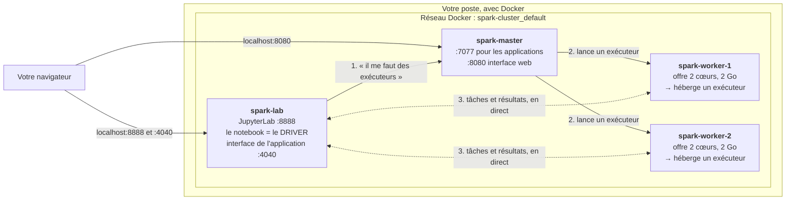
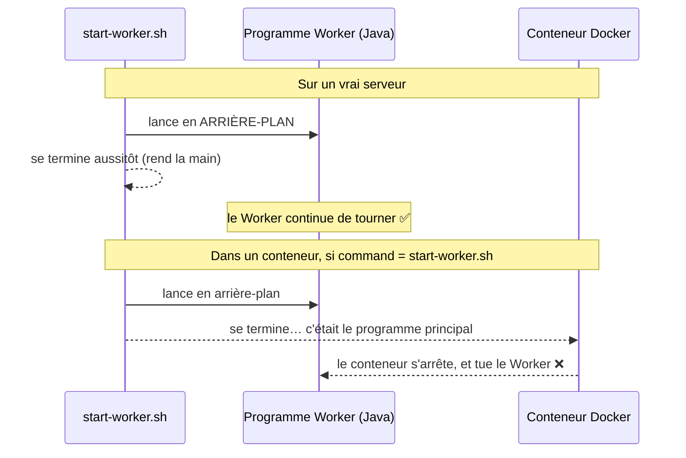
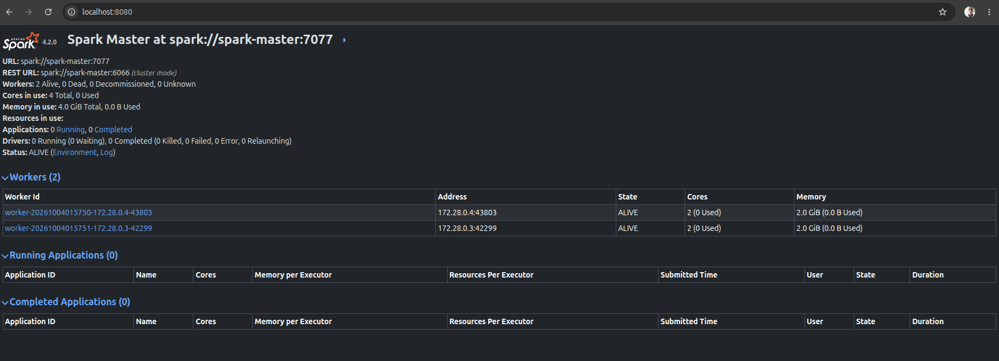
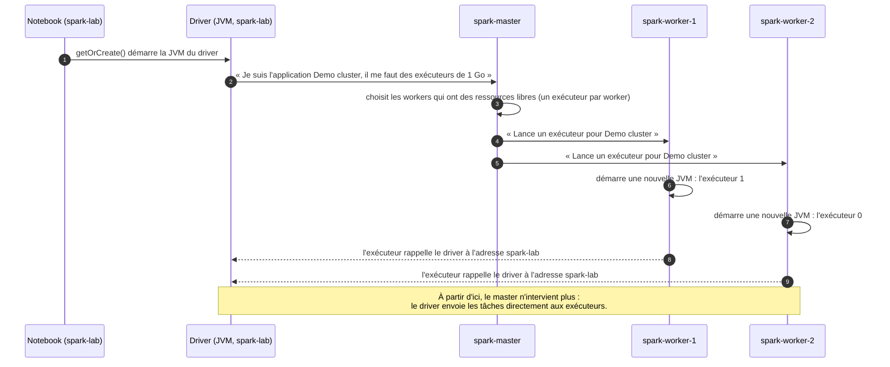
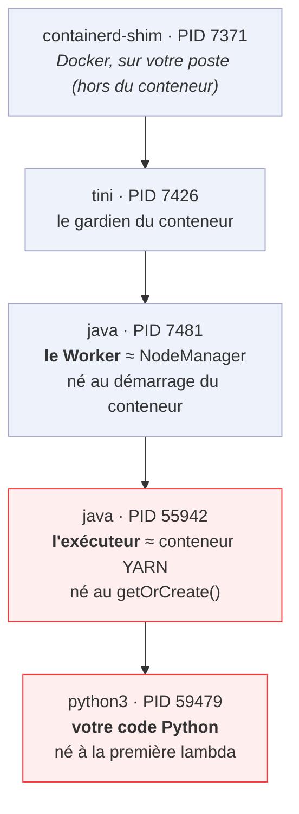
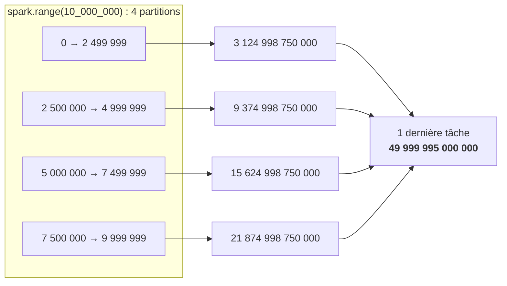
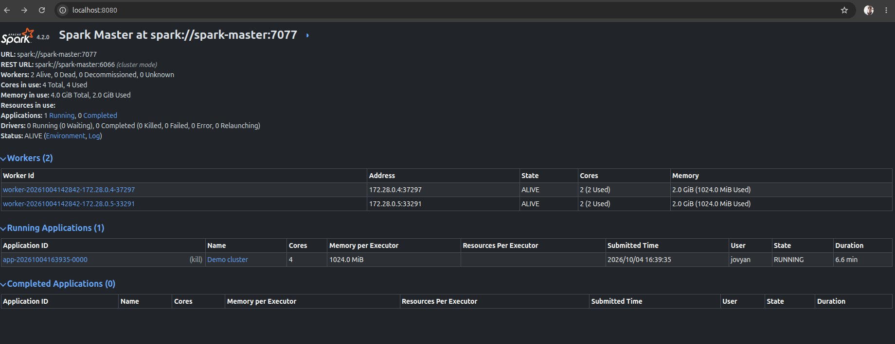
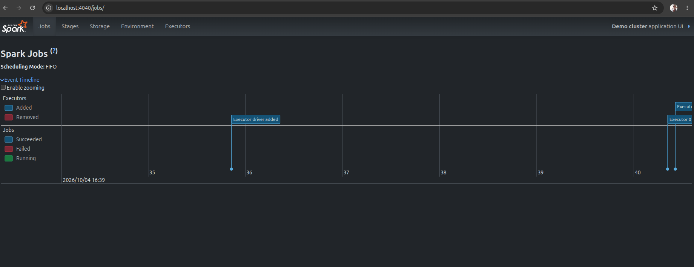
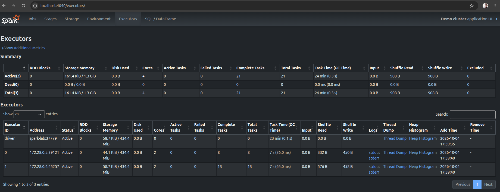

# TP : monter un cluster Spark Standalone avec Docker

> Formation **PySpark – Traitement des données** · Jour 1 après-midi · Notion 3, « Spark sur un cluster et dans le cloud »
> Document à refaire chez soi, étape par étape. Durée : 45 minutes environ.
> Fichier prêt à l'emploi dans ce dossier : [`docker-compose.yaml`](docker-compose.yaml) · [Retour au sommaire du dépôt](../../README.md)

## Sommaire

1. [Ce que l'on va construire](#1-ce-que-lon-va-construire)
2. [Prérequis](#2-prérequis)
3. [Étape 0 : l'environnement `spark-lab`](#3-étape-0--lenvironnement-spark-lab)
4. [Étape 1 : Java, Spark et Python sur chaque machine](#4-étape-1--java-spark-et-python-sur-chaque-machine)
5. [Étapes 2 et 3 : décrire le master et les workers](#5-étapes-2-et-3--décrire-le-master-et-les-workers)
6. [Démarrer le cluster et le vérifier](#6-démarrer-le-cluster-et-le-vérifier)
7. [Relier `spark-lab` au réseau du cluster](#7-relier-spark-lab-au-réseau-du-cluster)
8. [Étape 4 : lancer une application sur le cluster](#8-étape-4--lancer-une-application-sur-le-cluster)
9. [Ce qui est né : la généalogie des processus](#9-ce-qui-est-né--la-généalogie-des-processus)
10. [Le calcul, et où il a eu lieu](#10-le-calcul-et-où-il-a-eu-lieu)
11. [Lire les interfaces 8080 et 4040](#11-lire-les-interfaces-8080-et-4040)
12. [Terminer et nettoyer](#12-terminer-et-nettoyer)
13. [Reprendre après un redémarrage du poste](#13-reprendre-après-un-redémarrage-du-poste)
14. [Dépannage](#14-dépannage)
15. [Mémo](#15-mémo)

---

## 1. Ce que l'on va construire

Un **vrai cluster Spark**, en mode **Standalone** (le gestionnaire de ressources fourni avec Spark), sur votre seul poste. Chaque « machine » du cluster est un **conteneur Docker** :



| Conteneur | Programme principal | Rôle | Équivalent dans YARN (le cluster Hadoop du matin) |
|---|---|---|---|
| `spark-master` | `org.apache.spark.deploy.master.Master` | Connaît les ressources du cluster et décide quel worker accueille quoi. **Ne calcule rien.** | ResourceManager |
| `spark-worker-1` et `-2` | `org.apache.spark.deploy.worker.Worker` | Annonce les ressources de **sa** machine et **lance les exécuteurs** sur ordre du master. **Ne calcule rien non plus.** | NodeManager |
| *(né pendant le TP)* | un **exécuteur**, dans chaque worker | **Calcule** : exécute les tâches de l'application | Conteneur YARN |
| `spark-lab` | JupyterLab, puis **le driver** | **Votre programme** : construit le plan, découpe en tâches, envoie, récupère les résultats | Le poste client |

> **Infrastructure ou application ?** Le master et les workers forment l'**infrastructure** : ils tournent en permanence, qu'il y ait du travail ou non. Le driver et les exécuteurs forment l'**application** : ils naissent avec la `SparkSession` et disparaissent avec elle. Comme un aéroport (la tour de contrôle et les pistes) et un vol (le commandant et l'équipage).

---

## 2. Prérequis

| Besoin | Vérification |
|---|---|
| Docker et Docker Compose | `docker --version` et `docker compose version` affichent un numéro de version |
| L'image `quay.io/jupyter/pyspark-notebook` (environ 2 Go à télécharger, près de 5 Go sur le disque) | `docker images \| grep pyspark` affiche une ligne. Sinon : `docker pull quay.io/jupyter/pyspark-notebook` |
| Environ **6 Go de mémoire libre** | Le cluster réserve 4 Go pour les workers, plus Jupyter et le driver |
| Le port **8080** libre | `ss -ltn \| grep ':8080 '` n'affiche rien (sous macOS : `lsof -i :8080`) |

> **Windows :** utilisez un terminal **WSL** ou **Git Bash** pour copier les commandes telles quelles. Dans PowerShell, remplacez `| grep …` par `| findstr …`, et créez le fichier `docker-compose.yaml` avec un éditeur de texte au lieu de la commande `cat > … <<'EOF'`.

> **Convention :** les lignes qui commencent par `$` sont des commandes à taper dans un terminal (sans le `$`). Les blocs « Attendu » montrent ce que vous devez obtenir. Les adresses IP, les numéros de port aléatoires et les PID **varient** d'une machine à l'autre : ce qui compte, c'est la forme du résultat.

---

## 3. Étape 0 : l'environnement `spark-lab`

C'est le conteneur Jupyter + PySpark de la notion 2. S'il existe déjà, passez à l'étape 1 (`docker start spark-lab` s'il est arrêté).

```bash
$ mkdir -p ~/spark-lab && cd ~/spark-lab
$ docker run -d --name spark-lab -p 8888:8888 -p 4040:4040 \
    -v "$PWD":/home/jovyan/work quay.io/jupyter/pyspark-notebook
```

| Morceau | Rôle |
|---|---|
| `-d` | En arrière-plan : le terminal vous est rendu. |
| `--name spark-lab` | Un nom fixe, utilisé dans toutes les commandes suivantes. |
| `-p 8888:8888` | Port du poste : port du conteneur. JupyterLab. |
| `-p 4040:4040` | L'interface de l'application Spark (elle n'existe que pendant qu'une `SparkSession` est ouverte). |
| `-v "$PWD":/home/jovyan/work` | Votre dossier `~/spark-lab` apparaît dans Jupyter sous le nom **work**. Tout ce qui est ailleurs disparaît avec le conteneur. |

Puis ouvrez Jupyter :

```bash
$ docker exec spark-lab jupyter server list
```

Attendu :

```
Currently running servers:
http://localhost:8888/?token=<48 caractères> :: /home/jovyan
```

Copiez l'adresse **jusqu'à la fin du jeton**, sans ` :: /home/jovyan`, et ouvrez-la dans le navigateur.

> ⚠️ **Le jeton est le mot de passe de Jupyter.** Ne le collez ni dans un chat ni sur un écran partagé. S'il a fuité : `docker restart spark-lab` en génère un nouveau.

---

## 4. Étape 1 : Java, Spark et Python sur chaque machine

**Ce que dit la documentation de Spark :** sur **chaque** machine du cluster, installer Java et **la même version** de Spark (une archive à décompresser, par exemple dans `/opt/spark`), et pour PySpark, **la même version de Python** partout. Sinon, l'erreur `Python in worker has different version than that in driver` apparaît dès la première fonction Python.

**Ce que nous faisons :** rien à la main. Toutes nos « machines » sont créées à partir de **la même image Docker**, qui contient déjà Java, Spark et Python. L'identité des versions est garantie par construction.

On le vérifiera à la [section 6](#6-démarrer-le-cluster-et-le-vérifier), une fois le cluster démarré.

---

## 5. Étapes 2 et 3 : décrire le master et les workers

### Ce que dit la documentation

| Étape | Sur de vrais serveurs, on tape… | Effet |
|---|---|---|
| 2. Démarrer le master | sur le serveur master : `sbin/start-master.sh` | Le master écoute les applications sur le port **7077** et affiche son interface web sur le port **8080**. |
| 3. Démarrer les workers | sur **chaque** serveur worker : `sbin/start-worker.sh spark://master:7077` | Chaque worker s'enregistre auprès du master et annonce ses cœurs et sa mémoire. |

`start-master.sh` et `start-worker.sh` sont de petits scripts livrés avec Spark, dans le dossier `sbin/` (*system binaries*, les commandes d'administration). Leur cœur, c'est **le nom d'un programme Java** :

```bash
$ docker exec spark-lab grep -h "CLASS=" /usr/local/spark/sbin/start-master.sh /usr/local/spark/sbin/start-worker.sh
```

Attendu :

```
CLASS="org.apache.spark.deploy.master.Master"
CLASS="org.apache.spark.deploy.worker.Worker"
```

### Pourquoi nous n'utilisons pas ces scripts dans Docker



**Règle de Docker :** un conteneur vit exactement aussi longtemps que son programme principal. On appelle donc directement `spark-class` avec **le même programme Java**, mais **au premier plan** : il devient le programme principal du conteneur, et ses journaux s'affichent dans `docker compose logs`.

> **Analogie :** `start-worker.sh`, c'est le gérant qui ouvre le restaurant, confie les clés au cuisinier et rentre chez lui. Docker est un immeuble qui ferme dès que la personne qui a ouvert la porte s'en va : il faut que ce soit le cuisinier lui-même qui ouvre, et qui reste.

### Le fichier `docker-compose.yaml`

> **Vous avez cloné le dépôt ?** Le fichier est déjà dans ce dossier. Placez-vous-y et passez directement à la vérification (`docker compose config --quiet`) :
>
> ```bash
> $ cd formation-pyspark/j1-apres-midi/spark-cluster
> ```
>
> Le nom du dossier, `spark-cluster`, compte : Docker Compose s'en sert comme préfixe pour nommer les conteneurs (`spark-cluster-spark-master-1`…) et le réseau (`spark-cluster_default`) utilisés dans tout le TP. Sinon, créez le fichier vous-même :

```bash
$ mkdir -p ~/spark-cluster && cd ~/spark-cluster
$ cat > docker-compose.yaml <<'EOF'
services:
  spark-master:
    image: quay.io/jupyter/pyspark-notebook
    hostname: spark-master
    command: ["/usr/local/spark/bin/spark-class", "org.apache.spark.deploy.master.Master"]
    environment:
      SPARK_MASTER_HOST: spark-master
    ports:
      - "8080:8080"            # l'interface web du master
    healthcheck:
      disable: true            # celui de l'image surveille Jupyter, absent ici

  spark-worker-1:
    image: quay.io/jupyter/pyspark-notebook
    hostname: spark-worker-1
    command: ["/usr/local/spark/bin/spark-class", "org.apache.spark.deploy.worker.Worker", "spark://spark-master:7077"]
    environment:
      SPARK_WORKER_CORES: "2"
      SPARK_WORKER_MEMORY: 2g
      SPARK_WORKER_DIR: /tmp/spark-worker
    depends_on: [spark-master]
    healthcheck:
      disable: true

  spark-worker-2:
    image: quay.io/jupyter/pyspark-notebook
    hostname: spark-worker-2
    command: ["/usr/local/spark/bin/spark-class", "org.apache.spark.deploy.worker.Worker", "spark://spark-master:7077"]
    environment:
      SPARK_WORKER_CORES: "2"
      SPARK_WORKER_MEMORY: 2g
      SPARK_WORKER_DIR: /tmp/spark-worker
    depends_on: [spark-master]
    healthcheck:
      disable: true
EOF
$ docker compose config --quiet && echo "Fichier valide"
$ docker compose config --services
```

Attendu :

```
Fichier valide
spark-master
spark-worker-1
spark-worker-2
```

> `<<'EOF'` … `EOF` écrit tout le texte compris entre les deux `EOF` dans le fichier. Si votre terminal réaffiche mal un long collage, ce n'est qu'un problème d'affichage : `docker compose config --services` confirme que les 3 services sont bien là.

### Le fichier, ligne par ligne

| Ligne | Rôle | Lien avec la documentation |
|---|---|---|
| `image: quay.io/jupyter/pyspark-notebook` | **La même image** pour tous : Java, Spark et Python identiques. | Étape 1 |
| `hostname: spark-master` / `spark-worker-1`… | Le **nom de la machine** sur le réseau. Les autres conteneurs la joignent par ce nom. | Les noms de serveurs |
| `command: [… "org.apache.spark.deploy.master.Master"]` | Démarre **le programme du master**, au premier plan. | Étape 2, `start-master.sh` |
| `SPARK_MASTER_HOST: spark-master` | Le nom sous lequel le master se présente. | |
| `ports: "8080:8080"` | Publie l'interface du master sur `localhost:8080`. Le port 7077 n'a pas besoin d'être publié : seuls les conteneurs du réseau l'utilisent. | |
| `command: [… "org.apache.spark.deploy.worker.Worker", "spark://spark-master:7077"]` | Démarre **le programme d'un worker**, et lui donne l'adresse du master à contacter. | Étape 3, `start-worker.sh spark://master:7077` |
| `SPARK_WORKER_CORES: "2"` et `SPARK_WORKER_MEMORY: 2g` | Ce que ce worker **offre** au cluster : un **plafond** pour l'ensemble des exécuteurs qu'il hébergera. Sans ces lignes, chaque worker annoncerait tous les cœurs et toute la mémoire du poste. | Comme `yarn.nodemanager.resource.*` dans YARN |
| `SPARK_WORKER_DIR: /tmp/spark-worker` | Où le worker range les fichiers et les journaux de ses exécuteurs. Par défaut, ce serait un dossier où l'utilisateur `jovyan` ne peut pas écrire. | |
| `depends_on: [spark-master]` | Démarre le master **avant** les workers. Si le master n'est pas encore prêt, le worker réessaie tout seul. | |
| `healthcheck: disable: true` | L'image vérifie normalement que Jupyter répond. Jupyter ne tourne pas ici : sans cette ligne, les conteneurs seraient marqués `unhealthy` à tort. | |

---

## 6. Démarrer le cluster et le vérifier

```bash
$ docker compose up -d
$ docker compose ps
```

Attendu : le réseau `spark-cluster_default` est créé, puis les 3 conteneurs `Up`, **sans** mention `(healthy)` (le bilan de santé est désactivé).

```
[+] Running 4/4
 ✔ Network spark-cluster_default             Created
 ✔ Container spark-cluster-spark-master-1    Started
 ✔ Container spark-cluster-spark-worker-2-1  Started
 ✔ Container spark-cluster-spark-worker-1-1  Started
```

### Les journaux du master

La JVM met quelques secondes à démarrer : attendez avant de lire les journaux.

```bash
$ sleep 10
$ docker compose logs spark-master | grep -iE "starting spark master|elected leader|registering worker"
```

Attendu :

```
spark-master-1  | 26/10/04 01:57:50 INFO Master: Starting Spark master at spark://spark-master:7077
spark-master-1  | 26/10/04 01:57:51 INFO Master: I have been elected leader! New state: ALIVE
spark-master-1  | 26/10/04 01:57:52 INFO Master: Registering worker 172.28.0.4:43803 with 2 cores, 2.0 GiB RAM
spark-master-1  | 26/10/04 01:57:52 INFO Master: Registering worker 172.28.0.3:42299 with 2 cores, 2.0 GiB RAM
```

| Ligne | Ce qu'elle dit |
|---|---|
| `Starting Spark master at spark://spark-master:7077` | Le master écoute les applications sur le port **7077**. |
| `I have been elected leader! New state: ALIVE` | En production, on peut avoir plusieurs masters (avec ZooKeeper), dont un seul actif. Seul ici, il est élu d'office. |
| `Registering worker 172.28.0.4:43803 with 2 cores, 2.0 GiB RAM` | Un worker s'est présenté : son adresse sur le réseau Docker, un port tiré au hasard, et **ce qu'il offre**. |

> Les heures sont en **UTC** (le fuseau du conteneur). La date est au format année/mois/jour.

### Vérifier l'étape 1 : les mêmes versions partout

```bash
$ for c in spark-cluster-spark-master-1 spark-cluster-spark-worker-1-1 spark-cluster-spark-worker-2-1 spark-lab; do
    echo "== $c"
    docker exec $c bash -c 'java -version 2>&1 | head -1; head -1 /usr/local/spark/RELEASE; python --version'
  done
```

Attendu : **4 blocs identiques**, du type :

```
== spark-cluster-spark-master-1
openjdk version "17.0.x" …
Spark 4.2.0 built for Hadoop 3.x.x
Python 3.x.x
== spark-cluster-spark-worker-1-1
(les mêmes trois lignes)
…
```

### La page du master : `http://localhost:8080`



| Où regarder | Attendu |
|---|---|
| `URL` | `spark://spark-master:7077` |
| `Workers` | `2 Alive, 0 Dead` |
| `Cores in use` | `4 Total, 0 Used` |
| `Memory in use` | `4.0 GiB Total, 0.0 B Used` |
| `Status` | `ALIVE` |
| Tableau **Workers** | 2 lignes `ALIVE`, `2 (0 Used)`, `2.0 GiB (0.0 B Used)` |
| **Running Applications** | `(0)` : aucune application pour l'instant |

---

## 7. Relier `spark-lab` au réseau du cluster

### Le problème : deux réseaux séparés

`spark-lab` a été créé avec `docker run`, le cluster avec `docker compose` : ils sont dans **deux réseaux Docker isolés**. Depuis le notebook, le nom `spark-master` est inconnu.

```
AVANT
[ Réseau « bridge » ]                  [ Réseau « spark-cluster_default » ]
┌──────────────────────┐               ┌──────────────────────────────────┐
│   ┌─────────────┐    │               │  ┌──────────────┐                │
│   │  spark-lab  │    │      ✗        │  │ spark-master │                │
│   └─────────────┘    │               │  └──────────────┘                │
│   (Jupyter, :8888)   │               │  ┌──────────────┐ ┌────────────┐ │
│                      │               │  │spark-worker-1│ │spark-wrk-2 │ │
└──────────────────────┘               │  └──────────────┘ └────────────┘ │
                                       └──────────────────────────────────┘

APRÈS  docker network connect spark-cluster_default spark-lab
[ Réseau « bridge » ]                  [ Réseau « spark-cluster_default » ]
┌──────────────────────┐               ┌──────────────────────────────────┐
│   ┌──────────────────┼───────────────┼──┐  ┌──────────────┐            │
│   │    spark-lab     │  2 « prises » │  │  │ spark-master │            │
│   └──────────────────┼───────────────┼──┘  └──────────────┘            │
│ le navigateur passe  │               │  ┌──────────────┐ ┌────────────┐ │
│ par ici (:8888)      │               │  │spark-worker-1│ │spark-wrk-2 │ │
└──────────────────────┘               │  └──────────────┘ └────────────┘ │
                                       └──────────────────────────────────┘
```

```bash
$ docker network connect spark-cluster_default spark-lab
```

`spark-lab` garde son premier réseau (Jupyter reste accessible sur `localhost:8888`) et en gagne un second, comme une deuxième carte réseau.

### Trois vérifications

**1. Du côté du conteneur** : à quels réseaux `spark-lab` est-il branché ?

```bash
$ docker inspect spark-lab --format '{{range $nom, $v := .NetworkSettings.Networks}}{{$nom}} {{end}}'
```

Attendu : `bridge spark-cluster_default`

**2. Du côté du réseau** : qui est branché sur `spark-cluster_default` ?

```bash
$ docker network inspect spark-cluster_default --format '{{range .Containers}}{{.Name}}  {{.IPv4Address}}{{println}}{{end}}'
```

Attendu : 4 conteneurs, par exemple :

```
spark-cluster-spark-master-1  172.28.0.3/16
spark-lab  172.28.0.2/16
spark-cluster-spark-worker-2-1  172.28.0.5/16
spark-cluster-spark-worker-1-1  172.28.0.4/16
```

**3. Le test qui compte** : les **noms** sont-ils reconnus, **dans les deux sens** ?

```bash
$ docker exec spark-lab getent hosts spark-master
$ docker compose exec spark-worker-1 getent hosts spark-lab
```

Attendu :

```
172.28.0.3      spark-master
172.28.0.2      spark-lab
```

| Sens | Pourquoi c'est nécessaire |
|---|---|
| `spark-lab` → `spark-master` | Le driver doit contacter le master pour demander des exécuteurs (flèche 1 du schéma). |
| `spark-worker-1` → `spark-lab` | Les exécuteurs doivent **rappeler** le driver pour recevoir leurs tâches (flèche 3). C'est la raison du réglage `spark.driver.host = spark-lab` de l'étape suivante. |

> **Les adresses IP changent** d'un démarrage à l'autre : Docker les distribue dans l'ordre où les conteneurs démarrent. C'est pourquoi la configuration n'utilise **que des noms** (`spark-master`, `spark-lab`), traduits à chaque fois par le DNS de Docker.

> Si la commande `network connect` répond `endpoint with name spark-lab already exists in network spark-cluster_default`, c'est que `spark-lab` est **déjà** branché : sans gravité.

---

## 8. Étape 4 : lancer une application sur le cluster

**Ce que dit la documentation :** pour lancer un traitement, `spark-submit --master spark://master:7077 app.py`, ou une `SparkSession` avec `.master("spark://master:7077")` dans un notebook.

### 8.1 Les processus avant

`docker top` liste les processus d'un conteneur, comme un Gestionnaire des tâches pour une seule « machine ». On ne garde que le nom des programmes Spark :

```bash
$ docker top spark-cluster-spark-master-1 | grep -o "org.apache.spark[A-Za-z.]*"
$ docker top spark-cluster-spark-worker-1-1 | grep -o "org.apache.spark[A-Za-z.]*"
$ docker top spark-lab | grep -o "org.apache.spark[A-Za-z.]*"
```

Attendu :

```
org.apache.spark.deploy.master.Master
org.apache.spark.deploy.master.Master
org.apache.spark.deploy.worker.Worker
org.apache.spark.deploy.worker.Worker
```

| Conteneur | Ce qu'on voit | Pourquoi |
|---|---|---|
| `spark-master` | `…master.Master` | Le master tourne depuis le `docker compose up`. |
| `spark-worker-1` | `…worker.Worker`, **seul** | Le worker attend du travail : aucun exécuteur, puisqu'aucune application. |
| `spark-lab` | **rien** | Jupyter tourne, mais aucune `SparkSession` n'est ouverte : pas de driver. |

> **Pourquoi chaque nom apparaît deux fois ?** Deux processus contiennent ce nom dans leur ligne de commande : le **lanceur** du conteneur (`tini`) et la **JVM** qu'il a démarrée. Pour le voir : `docker top spark-cluster-spark-master-1 -eo pid,ppid,comm` affiche une ligne `tini`, puis une ligne `java` dont le parent (PPID) est `tini`. Il n'y a qu'**un** master.

### 8.2 La `SparkSession` sur le cluster

Dans JupyterLab, si un autre notebook a une session Spark ouverte, arrêtez son noyau (**Kernel → Shut Down Kernel**) pour libérer le port 4040. Puis, dans **work** (le chemin au-dessus des fichiers doit afficher **/ work /**), créez un notebook `cluster.ipynb` :

```python
# Cellule 1 : une session sur le cluster
from pyspark.sql import SparkSession
import socket

spark = (SparkSession.builder.appName("Demo cluster")
         .master("spark://spark-master:7077")            # le master, au lieu de local[*]
         .config("spark.driver.host", "spark-lab")       # l'adresse où les exécuteurs joignent le driver
         .config("spark.driver.bindAddress", "0.0.0.0")
         .config("spark.executor.memory", "1g")
         .getOrCreate())
sc = spark.sparkContext
print("Master       :", sc.master)
print("Parallélisme :", sc.defaultParallelism)
```

| Ligne | Rôle |
|---|---|
| `import socket` | Bibliothèque standard de Python ; servira à demander « sur quelle machine suis-je ? ». |
| `.appName("Demo cluster")` | Le nom affiché sur la page 8080 du master et sur la page 4040. |
| `.master("spark://spark-master:7077")` | **Le cœur de l'étape 4 :** au lieu de `local[*]`, on confie le calcul au cluster. |
| `.config("spark.driver.host", "spark-lab")` | Le driver annonce aux exécuteurs : « rappelez-moi à l'adresse `spark-lab` ». |
| `.config("spark.driver.bindAddress", "0.0.0.0")` | Le driver écoute sur ses deux cartes réseau. |
| `.config("spark.executor.memory", "1g")` | Chaque exécuteur demande 1 Go : cela tient dans les 2 Go offerts par chaque worker. |
| `.getOrCreate()` | **Le moment où tout se déclenche.** |

Attendu, après 10 à 20 secondes :

```
Master       : spark://spark-master:7077
Parallélisme : 4
```

**4** = les 2 + 2 cœurs offerts par les workers. En local, c'était le nombre de cœurs de votre poste.

### 8.3 Ce qui se passe pendant `getOrCreate()`



---

## 9. Ce qui est né : la généalogie des processus

Relancez les commandes `docker top` :

```bash
$ docker top spark-cluster-spark-worker-1-1 | grep -o "org.apache.spark[A-Za-z.]*"
$ docker top spark-cluster-spark-worker-2-1 | grep -o "org.apache.spark[A-Za-z.]*"
$ docker top spark-lab | grep -o "org.apache.spark[A-Za-z.]*"
```

Attendu :

```
org.apache.spark.deploy.worker.Worker
org.apache.spark.deploy.worker.Worker
org.apache.spark.executor.CoarseGrainedExecutorBackend
org.apache.spark.deploy.worker.Worker
org.apache.spark.deploy.worker.Worker
org.apache.spark.executor.CoarseGrainedExecutorBackend
org.apache.spark.deploy.SparkSubmit
```

| Conteneur | Ce qui est né | Qui est-ce ? |
|---|---|---|
| `spark-worker-1` | `CoarseGrainedExecutorBackend` | **Un exécuteur**, lancé par le Worker sur ordre du master. *Coarse-grained* (« à gros grain ») : il est réservé pour toute la durée de l'application. |
| `spark-worker-2` | `CoarseGrainedExecutorBackend` | Le second exécuteur. |
| `spark-lab` | `SparkSubmit` | **La JVM du driver**, démarrée par `getOrCreate()`. |

### L'arbre complet d'un worker, après le calcul de la section 10

Après avoir exécuté la cellule 2 de la [section 10](#10-le-calcul-et-où-il-a-eu-lieu), affichez les processus de `spark-worker-1` avec leur **parent** :

```bash
$ docker top spark-cluster-spark-worker-1-1 -eo pid,ppid,comm
```

Attendu (les numéros varient) :

```
PID                 PPID                COMMAND
7426                7371                tini
7481                7426                java
55942               7481                java
59479               55942               python3
```

#### Les colonnes

| Colonne | Signification |
|---|---|
| **PID** (*Process ID*) | Le numéro unique du processus. Il est attribué dans l'ordre de création : **plus il est grand, plus le processus est récent**. |
| **PPID** (*Parent Process ID*) | Le PID du processus **qui l'a lancé**, son parent. C'est ce qui permet de reconstituer « qui a lancé qui ». |
| **COMMAND** | Le nom court du programme. |

#### Les lignes

| PID | PPID | COMMAND | Qui est-ce ? | Né quand ? | Lancé par | Équivalent YARN |
|---|---|---|---|---|---|---|
| 7426 | 7371 | `tini` | Le **gardien du conteneur** : le premier processus, qui démarre le `command:` et relaie les signaux d'arrêt. Son parent, 7371, est **hors du conteneur** : c'est Docker (`containerd-shim`), sur votre poste. | Au `docker compose up` | Docker | Le démarrage de la machine |
| 7481 | 7426 | `java` | Le **Worker** : `org.apache.spark.deploy.worker.Worker`, le `command:` du fichier. Il gère la machine et attend les ordres du master. | Une seconde après `tini` | `tini` | NodeManager |
| 55942 | 7481 | `java` | **L'exécuteur** de l'application *Demo cluster* (`CoarseGrainedExecutorBackend`). C'est lui qui calcule. | **Au `getOrCreate()`** de la cellule 1 | le Worker, sur ordre du master | Conteneur YARN |
| 59479 | 55942 | `python3` | Le **Python** qui exécute votre code Python (la `lambda`). La JVM ne sait pas exécuter du Python : elle lance ce processus à côté d'elle, lui passe les données, et récupère les résultats. | **À la cellule 2**, à la première fonction Python | l'exécuteur | Un processus dans le conteneur YARN |



> **À retenir :** en bleu, l'**infrastructure** (là avant l'application, encore là après). En rouge, l'**application** (née pendant le TP, disparaît avec `spark.stop()`).
>
> **Pourquoi un `python3` ?** La somme `selectExpr("sum(id)")` est calculée entièrement par la JVM, sans Python. Mais une `lambda` est du **code Python** : les données doivent faire l'aller-retour entre Java et Python. C'est pour cela qu'une fonction Python maison est plus lente qu'une fonction de Spark.

Pour comparer, le master n'a que deux processus :

```bash
$ docker top spark-cluster-spark-master-1 -eo pid,ppid,comm
PID                 PPID                COMMAND
7304                7282                tini
7353                7304                java
```

---

## 10. Le calcul, et où il a eu lieu

```python
# Cellule 2 : le même calcul qu'en local, et où il a tourné
spark.range(10_000_000).selectExpr("sum(id) AS total").show()

machines = sc.parallelize(range(8), 8).map(lambda x: socket.gethostname()).distinct().collect()
print("Tâches exécutées sur :", sorted(machines))
```

Attendu :

```
+--------------+
|         total|
+--------------+
|49999995000000|
+--------------+

Tâches exécutées sur : ['spark-worker-1', 'spark-worker-2']
```

### 10.1 La somme

**Vérification de tête** (la formule de Gauss) : la somme de 0 à n − 1 vaut n × (n − 1) / 2, soit 10 000 000 × 9 999 999 / 2 = **49 999 995 000 000**.

Spark découpe les nombres en **4 partitions** (une par cœur du cluster). Chaque partition est **une tâche**, envoyée à un exécuteur :



C'est **le même code** qu'en local, et **le même résultat**. Seul l'endroit du calcul a changé.

### 10.2 La liste des machines, morceau par morceau

| Morceau | Ce qu'il fait |
|---|---|
| `sc.parallelize(range(8), 8)` | Un RDD de 8 nombres (0 à 7) en **8 partitions** : un nombre par partition, donc **8 tâches**. |
| `.map(lambda x: socket.gethostname())` | Chaque tâche remplace son nombre par **le nom de la machine où elle s'exécute**. Le `x` est ignoré : il ne sert que de prétexte pour exécuter du code dans chaque tâche. |
| `.distinct()` | Ne garde que les noms différents. Pour comparer des noms venus de partitions différentes, Spark doit les rassembler : c'est un **shuffle**. |
| `.collect()` | **L'action** : déclenche tout, puis ramène le résultat dans le driver sous forme de liste Python. |
| `sorted(…)` | Trie la liste, pour un affichage stable. |

**Le point clé :** la `lambda` ne s'exécute **pas** dans le notebook. Spark l'**emballe**, l'**envoie** avec chaque tâche aux exécuteurs, et c'est là-bas qu'elle s'exécute. `socket.gethostname()` répond donc avec le nom **du worker où elle tourne** (le `hostname:` du fichier Compose).

> **Analogie :** vous envoyez 8 cartes postales identiques avec une seule question, « écrivez le nom de votre ville et renvoyez la carte ». La réponse dépend de **qui reçoit la carte**, pas de celui qui l'envoie.

**Contre-épreuve** : dans une cellule du notebook, exécutez directement `socket.gethostname()`. La fonction tourne alors **dans `spark-lab`**, et renvoie son identifiant de conteneur (par exemple `103bc05c4256`). Même fonction, autre machine, autre réponse.

**Ce que prouve le résultat :** les **deux** workers ont travaillé, et `spark-lab` n'a calculé **aucune** tâche. Le driver a dirigé, il n'a pas exécuté.

### 10.3 Le détail, tâche par tâche (facultatif)

```python
# Cellule 3 : chaque tâche renvoie son numéro et la machine où elle a tourné
sc.parallelize(range(8), 8).map(lambda x: (x, socket.gethostname())).collect()
```

Attendu, par exemple :

```
[(0, 'spark-worker-2'), (1, 'spark-worker-1'), (2, 'spark-worker-2'), (3, 'spark-worker-1'),
 (4, 'spark-worker-2'), (5, 'spark-worker-1'), (6, 'spark-worker-2'), (7, 'spark-worker-1')]
```

La répartition **change d'une exécution à l'autre**, et n'est pas forcément égale : le driver confie chaque tâche au **premier cœur libre**.

---

## 11. Lire les interfaces 8080 et 4040

### 8080 ou 4040 : quelle différence ?

| | **8080 : l'interface du master** | **4040 : l'interface de l'application** |
|---|---|---|
| Qui l'affiche | Le gestionnaire du cluster (`spark-master`) | Le **driver**, dans `spark-lab` |
| Ce qu'elle montre | Les **machines et les ressources** : workers, cœurs, mémoire, applications | **Le travail d'une application** : jobs, stages, tâches, exécuteurs |
| Durée de vie | Tant que le cluster tourne | Tant que la `SparkSession` existe |
| Combien | Une par cluster | Une par application (4040, puis 4041…) |
| En mode `local[*]` | N'existe pas | Existe |
| Équivalent YARN | L'interface du ResourceManager (port 8088) | — |

> **Analogie :** 8080, c'est la **tour de contrôle** : elle voit les pistes libres et occupées, et quels avions sont là. 4040, c'est le **tableau de bord d'un avion** : ce qui se passe pendant le vol.

### `localhost:8080` pendant l'application



| Où regarder | Attendu | Ce que ça veut dire |
|---|---|---|
| `Cores in use` | `4 Total, 4 Used` | Tous les cœurs du cluster sont réservés pour l'application. |
| `Memory in use` | `4.0 GiB Total, 2.0 GiB Used` | 2 exécuteurs × 1 Go (`spark.executor.memory`). |
| Workers | `2 (2 Used)` et `2.0 GiB (1024.0 MiB Used)` | Chaque worker a prêté ses 2 cœurs et 1 Go. |
| Running Applications | `Demo cluster`, 4 cœurs, `1024.0 MiB` par exécuteur, utilisateur `jovyan`, `RUNNING` | Notre notebook, vu par le master. |
| `Drivers` | `0 Running` | Normal : notre driver est **dans `spark-lab`** (mode *client*). Le master ne compte ici que les drivers qu'il héberge lui-même (mode *cluster*). |

> Le lien `(kill)` à côté de l'application permet à l'administrateur de l'arrêter depuis le master.

### `localhost:4040`, onglet **Jobs** : la chronologie des naissances



La frise (**Event Timeline**) montre `Executor driver added`, puis environ **5 secondes plus tard** `Executor 0` et `Executor 1`. Ces secondes, c'est le circuit de la [section 8.3](#83-ce-qui-se-passe-pendant-getorcreate) : inscription auprès du master, lancement d'une JVM par chaque worker, rappel du driver. Aucun job n'apparaît tant qu'aucune action n'a été lancée : `getOrCreate()` n'en est pas une.

### `localhost:4040`, onglet **Executors** : qui a travaillé ?

Capture prise après la cellule 2 :



| Executor ID | Address | Cores | Complete Tasks | Qui est-ce ? |
|---|---|---|---|---|
| `driver` | `spark-lab:…` | 0 | **0** | Le driver : il dirige, il ne calcule pas. |
| `0` | `172.28.0.5:…` | 2 | 8 | L'exécuteur de `spark-worker-2` (son adresse, d'après `docker network inspect`). |
| `1` | `172.28.0.4:…` | 2 | 13 | L'exécuteur de `spark-worker-1`. |

**D'où viennent les 21 tâches ?**

| Action | Tâches |
|---|---|
| La somme : une tâche par partition | 4 |
| L'addition des 4 sommes partielles (Spark découpe l'exécution en deux temps pour ajuster son plan : *Adaptive Query Execution*) | 1 |
| `parallelize(…).map(…)` : la première moitié du `distinct` | 8 |
| La seconde moitié du `distinct`, après le shuffle | 8 |
| **Total** | **21** |

Si vous avez aussi exécuté la cellule 3, ajoutez 8 tâches : **29**.

**Les autres colonnes :**

| Colonne | Ce qu'on y lit |
|---|---|
| **Storage Memory : 434,4 MiB** | Sur 1 Go, Spark réserve 300 Mo pour son fonctionnement, puis consacre 60 % du reste aux données : (1 024 − 300) × 0,6 = **434,4 Mio**. Le résumé affiche 1,3 Gio : 3 JVM (le driver a aussi 1 Go par défaut). |
| **Shuffle Read / Write** | Quelques centaines d'octets : les données échangées pendant les shuffles (les sommes partielles, les noms du `distinct`). Sur de vraies données, ce sont des Go : c'est là qu'on repère un traitement coûteux. |
| **Task Time du driver** | Une durée de plusieurs minutes, alors qu'il n'a exécuté aucune tâche : c'est le temps écoulé depuis sa naissance, pas du calcul. |
| **Logs `stdout` / `stderr`** | Les journaux des exécuteurs, rangés par chaque worker dans `SPARK_WORKER_DIR`. Les liens pointent vers l'interface interne des workers (port 8081), non publiée ici. |
| **Add Time** | Le driver d'abord, les exécuteurs quelques secondes après. |

> **En local, cette page n'avait qu'une ligne :** `driver`, avec tous les cœurs du poste. Le driver faisait tout lui-même. Sur le cluster, il a **0 cœur et 0 tâche** : c'est ça, un calcul distribué.

---

## 12. Terminer et nettoyer

### 12.1 Arrêter l'application

```python
# Cellule 4
spark.stop()
```

```bash
$ docker top spark-cluster-spark-worker-1-1 -eo pid,ppid,comm
$ docker top spark-lab | grep -o "org.apache.spark[A-Za-z.]*"
```

Attendu :

```
PID                 PPID                COMMAND
7426                7371                tini
7481                7426                java
org.apache.spark.deploy.SparkSubmit
```

| Ce que `spark.stop()` arrête | Ce qu'il n'arrête pas |
|---|---|
| L'**application** : les exécuteurs et leur `python3` disparaissent des workers, l'application passe dans *Completed Applications* sur la page 8080, et `localhost:4040` ne répond plus. | La **JVM** `SparkSubmit` de `spark-lab` : le noyau Python la garde en veille, prête pour une prochaine session. Elle disparaît à l'**arrêt du noyau** (Kernel → Shut Down Kernel). |

### 12.2 Supprimer le cluster

```bash
$ docker network disconnect spark-cluster_default spark-lab
$ cd ~/spark-cluster && docker compose down      # ou le dossier spark-cluster du dépôt
```

Attendu :

```
[+] Running 4/4
 ✔ Container spark-cluster-spark-worker-2-1  Removed
 ✔ Container spark-cluster-spark-worker-1-1  Removed
 ✔ Container spark-cluster-spark-master-1    Removed
 ✔ Network spark-cluster_default             Removed
```

| Commande | Effet |
|---|---|
| `docker network disconnect …` | Débranche `spark-lab` du réseau du cluster. Il garde son réseau d'origine. |
| `docker compose down` | **Supprime** les 3 conteneurs et le réseau. Le fichier `docker-compose.yaml` reste : `docker compose up -d` recrée tout. |
| `docker compose stop` *(alternative)* | **Arrête** sans supprimer : `docker compose start` relance le même cluster. |

---

## 13. Reprendre après un redémarrage du poste

À l'extinction du poste, Docker **arrête** les conteneurs sans les supprimer. `docker ps` (les conteneurs **en marche**) est alors vide, mais `docker ps -a` (**tous** les conteneurs, `-a` = *all*) les montre en `Exited`.

```bash
$ docker start spark-lab
$ cd ~/spark-cluster && docker compose start     # ou le dossier spark-cluster du dépôt
$ docker ps --format "table {{.Names}}\t{{.Status}}"
```

Attendu :

```
NAMES                            STATUS
spark-cluster-spark-worker-2-1   Up 20 seconds
spark-cluster-spark-worker-1-1   Up 20 seconds
spark-cluster-spark-master-1     Up 20 seconds
spark-lab                        Up 21 seconds (healthy)
```

- **Pas de `docker run`** : il recréerait un conteneur et répondrait `name already in use`.
- **Le `docker network connect` est conservé** : inutile de le refaire. Vérifiez avec `docker exec spark-lab getent hosts spark-master`.
- **Nouveau jeton Jupyter** : `docker exec spark-lab jupyter server list`.
- **Les variables du notebook sont perdues** : réexécutez les cellules depuis le début.
- Pour ne voir que les journaux récents : `docker compose logs --since 2m spark-master`.

**Le code entre parenthèses** de `Exited (…)` dans `docker ps -a` :

| Code | Signification |
|---|---|
| `0` | Arrêt propre, de lui-même. |
| `143` | 128 + 15 : arrêté par le signal **SIGTERM**, la demande polie (`docker stop`, extinction du poste). Normal. |
| `137` | 128 + 9 : tué par **SIGKILL**, l'arrêt forcé : il n'a pas fermé à temps, ou il a manqué de mémoire. |
| `1` ou autre | Arrêt sur **erreur** : lisez `docker logs <nom>`. |

---

## 14. Dépannage

| Symptôme | Cause probable | Solution |
|---|---|---|
| Le `grep` des journaux du master n'affiche rien | Le master n'a pas fini de démarrer | Attendez quelques secondes et relancez la commande |
| `Bind for 0.0.0.0:8080 failed: port is already allocated` | Un autre programme utilise le port 8080 | Remplacez `"8080:8080"` par `"8090:8080"`, puis ouvrez `localhost:8090` |
| `getent hosts spark-master` n'affiche rien | `spark-lab` n'est pas branché sur le réseau du cluster | `docker network connect spark-cluster_default spark-lab` |
| `UnknownHostException: spark-master` dans le notebook | Même cause | Même solution |
| La cellule 1 affiche `Master : local[*]` | Une session locale existait déjà dans ce noyau : `getOrCreate()` l'a renvoyée | `spark.stop()`, puis réexécutez la cellule |
| `Initial job has not accepted any resources` | Aucun exécuteur n'a démarré : workers absents, mémoire demandée trop grande, ou driver injoignable | Sur `localhost:8080`, vérifiez les 2 workers **ALIVE** ; gardez `spark.executor.memory` ≤ `SPARK_WORKER_MEMORY` ; vérifiez `spark.driver.host` et le `getent` dans le sens worker → `spark-lab` |
| `localhost:4040` ne répond pas | Aucune `SparkSession` ouverte, ou une autre application occupe le 4040 (la vôtre est alors sur 4041, non publié) | Exécutez la cellule 1 ; arrêtez les noyaux des autres notebooks |
| `Python in worker has different version than that in driver` | Versions de Python différentes entre `spark-lab` et les workers | Utilisez **la même image** partout |
| `endpoint with name spark-lab already exists` | `spark-lab` est déjà branché | Rien à faire |
| Les conteneurs du cluster sont `unhealthy` | La ligne `healthcheck: disable: true` manque | Ajoutez-la, puis `docker compose up -d` |

---

## 15. Mémo

### La documentation de Spark et ce TP

| Documentation | Sur de vrais serveurs | Dans ce TP |
|---|---|---|
| 1. Java et la même version de Spark et de Python partout | Installation à la main sur chaque machine | La même image Docker pour tous les conteneurs |
| 2. `sbin/start-master.sh` | Sur le serveur master | `command: […master.Master]`, exécuté par `docker compose up` |
| 3. `sbin/start-worker.sh spark://master:7077` | Sur chaque serveur worker | `command: […worker.Worker, spark://spark-master:7077]` |
| 4. `.master("spark://master:7077")` | Depuis un poste client | La cellule 1 de `cluster.ipynb`, depuis `spark-lab` |

### Standalone et YARN

| Rôle | Spark Standalone | YARN |
|---|---|---|
| Gestionnaire du cluster | Master (`spark-master`) | ResourceManager |
| Gestionnaire d'une machine | Worker | NodeManager |
| Processus qui calcule | Exécuteur, lancé par le worker | Exécuteur, dans un conteneur YARN |
| Interface du cluster | `:8080` | `:8088` |
| Intermédiaire entre l'application et le cluster | Aucun : le driver parle directement au master | Un ApplicationMaster par application |
| Où installer Spark | Sur chaque machine | Sur le seul poste qui soumet les applications |

### Les battements de cœur

| Qui | Vers qui | Fréquence par défaut | En cas de silence |
|---|---|---|---|
| Chaque worker | Le master | Toutes les 15 secondes | Au bout de 60 secondes, le worker passe `DEAD` sur la page 8080 |
| Chaque exécuteur | Le driver | Toutes les 10 secondes | Le driver considère l'exécuteur perdu et relance ses tâches ailleurs |

### Le local et le cluster

| | `master = local[*]` | `master = spark://spark-master:7077` |
|---|---|---|
| Driver | Dans `spark-lab` | Dans `spark-lab` |
| Exécuteurs | Dans la même JVM que le driver | Un par worker, dans les conteneurs workers |
| Gestionnaire | Aucun | `spark-master` |
| Parallélisme | Les cœurs du poste | Les cœurs offerts par les workers (ici 4) |
| `socket.gethostname()` dans une tâche | L'identifiant du conteneur `spark-lab` | `spark-worker-1` ou `spark-worker-2` |
| Le code de traitement | **Identique** | **Identique** |

> **À retenir :** partout, le même code PySpark. Ce qui change d'un environnement à l'autre : le `master`, l'adresse des fichiers, et qui s'occupe des machines.
