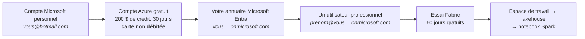
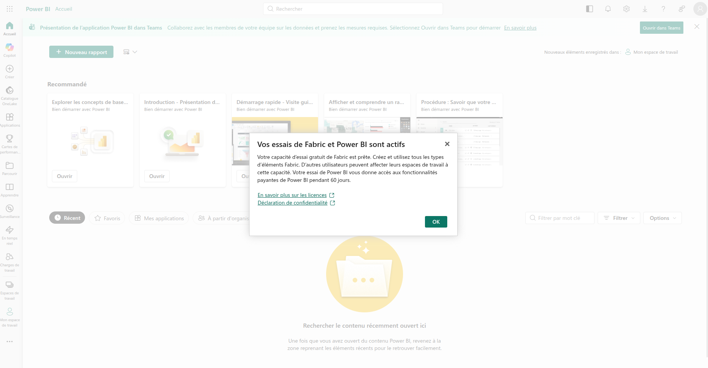
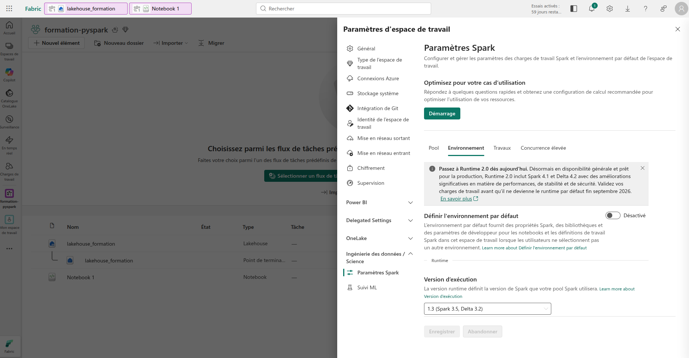
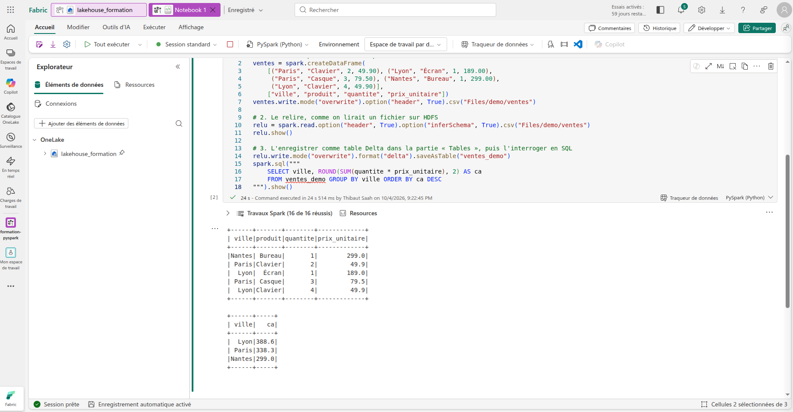
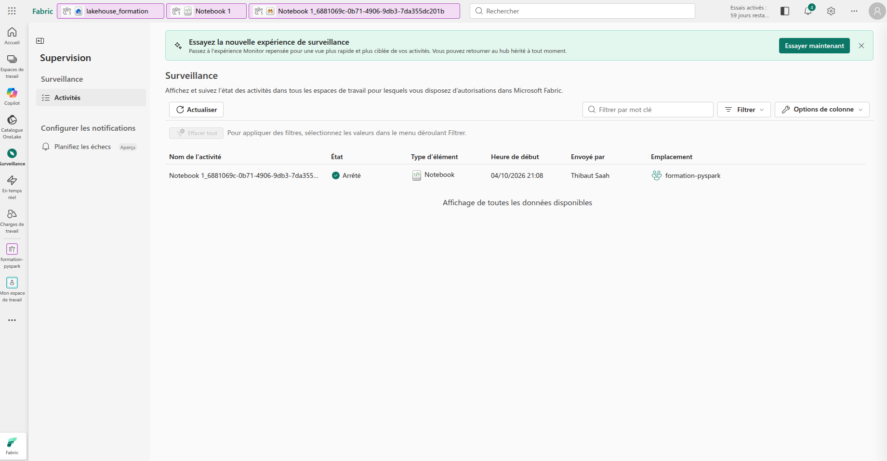
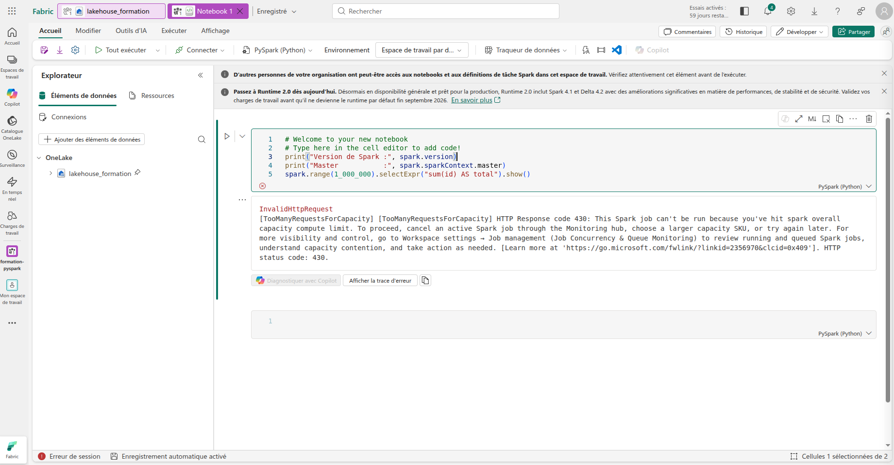

# TP : Spark dans Azure avec Microsoft Fabric, gratuitement

> Formation **PySpark – Traitement des données** · Jour 1 après-midi · Notion 3, « Spark sur un cluster et dans le cloud »
> Durée : 45 minutes environ, dont 20 minutes d'inscription. Coût : **0 €**.
> [Retour au sommaire du dépôt](../../README.md) · Tutoriel voisin : [le cluster Spark Standalone](../spark-cluster/README.md)

## Sommaire

1. [Ce que l'on va faire](#1-ce-que-lon-va-faire)
2. [Le compte Azure gratuit](#2-le-compte-azure-gratuit)
3. [L'utilisateur professionnel](#3-lutilisateur-professionnel)
4. [La première connexion à Fabric](#4-la-première-connexion-à-fabric)
5. [L'essai Fabric de 60 jours](#5-lessai-fabric-de-60-jours)
6. [L'espace de travail et le runtime Spark](#6-lespace-de-travail-et-le-runtime-spark)
7. [Le premier notebook Spark](#7-le-premier-notebook-spark)
8. [Le lakehouse, le « HDFS » de Fabric](#8-le-lakehouse-le--hdfs--de-fabric)
9. [Surveiller ses applications](#9-surveiller-ses-applications)
10. [Dépannage](#10-dépannage)
11. [Mémo : le même code, trois infrastructures](#11-mémo--le-même-code-trois-infrastructures)

---

## 1. Ce que l'on va faire

**Microsoft Fabric** est la plateforme de données de Microsoft : notebooks Spark, lakehouse, rapports Power BI. Microsoft la recommande pour les nouveaux projets Spark sur Azure. Son **essai gratuit de 60 jours** permet de faire tourner Spark dans le cloud sans rien payer.

**La difficulté :** l'essai Fabric refuse les adresses personnelles (Gmail, Hotmail…). Il faut un compte **professionnel**. Pour un particulier, Microsoft documente ce chemin :



| Étape | Coût |
|---|---|
| Compte Azure gratuit | 0 € : vérification de la carte d'environ 1 $, aussitôt annulée |
| Utilisateur professionnel | 0 € |
| Essai Fabric (60 jours) | 0 €, sans consommer le crédit Azure |

---

## 2. Le compte Azure gratuit

1. Sur **azure.microsoft.com/free** → **Try Azure for free** : connectez-vous avec votre compte Microsoft personnel, ou créez-en un avec votre adresse habituelle.
2. **Profil :** le pays doit être celui de l'**adresse de facturation de votre carte**.
3. **Téléphone :** un code par SMS ou par appel.
4. **Carte :** une carte de débit ou de crédit, non prépayée, ouverte aux paiements internationaux en ligne.
5. **Sign up** → vous arrivez sur **portal.azure.com**.

**Attendu :** la page d'accueil du portail affiche **« 200 USD de crédits restants »**.

> ⚠️ **La règle qui protège votre carte.** Un compte gratuit n'est **jamais débité** tant que vous ne cliquez pas sur **« Mettre à niveau vers le paiement à l'utilisation »** (*Upgrade*). Ne cliquez jamais sur ce bouton pour ce TP. Au bout de 30 jours, ou une fois le crédit épuisé, Azure arrête les ressources : il ne facture pas.

**Vérifications conseillées :**
- **Abonnements** : une ligne *Azure subscription 1*, état **Actif**.
- **Alerte de budget** : abonnement → **Gestion des coûts** → **Budgets** → **+ Ajouter** → 10 $ par mois, alertes à 50 % et 100 % envoyées sur votre e-mail.

> Ne communiquez jamais votre numéro de carte, ni les codes reçus par SMS. Masquez-les sur toute capture d'écran.

---

## 3. L'utilisateur professionnel

Le compte Azure a créé un **annuaire** (*Default Directory*) dont vous êtes l'**administrateur général**. On y crée un utilisateur professionnel.

1. Portail Azure → **Microsoft Entra ID** → **Vue d'ensemble** : notez le **domaine principal**, de la forme `vous….onmicrosoft.com`.
2. **Gérer** → **Utilisateurs** → **+ Nouvel utilisateur** → **Créer un utilisateur**.

| Champ | Valeur |
|---|---|
| Nom d'utilisateur principal | `prenom` @ le domaine `….onmicrosoft.com` proposé |
| Nom d'affichage | Votre nom |
| Mot de passe | **Générer automatiquement**, puis **copiez-le** : il ne sera plus réaffiché |
| Compte activé | Coché |
| Onglet **Propriétés** → Emplacement d'utilisation | Votre pays |

3. **Vérifier + créer** → **Créer**.

**Attendu :** la liste des utilisateurs compte **2 lignes**. Votre compte personnel y apparaît sous une forme transformée (`…#EXT#…`), et le nouvel utilisateur en `prenom@….onmicrosoft.com`, de type **Membre**.

---

## 4. La première connexion à Fabric

1. Installez **Microsoft Authenticator** sur votre téléphone.
2. Ouvrez une **fenêtre de navigation privée** : sinon, le navigateur vous reconnecte avec votre compte personnel.
3. Allez sur **app.fabric.microsoft.com** et connectez-vous avec `prenom@….onmicrosoft.com` et le mot de passe généré.

| Écran | Ce que vous faites |
|---|---|
| Mettre à jour votre mot de passe | Le mot de passe généré, puis un **nouveau** mot de passe, à noter. **C'est désormais lui qu'il faudra saisir** : le généré ne fonctionne plus. |
| Plus d'informations requises | **Suivant** : la configuration de la double authentification |
| Scanner le code QR | Dans Authenticator : **+** → **Compte professionnel ou scolaire** → **Scanner un code QR** |
| Notification de test | Tapez dans le téléphone le **nombre** affiché à l'écran → **Oui** |

> ⚠️ **Ne partagez jamais ce QR code**, même en capture d'écran : il permet de lier un téléphone à votre compte.

4. **Inscription à Fabric (gratuit) :** pays, poste, nom de l'entreprise (votre activité), téléphone → **Démarrer**.

**Attendu :** la page d'accueil de Fabric, dans l'expérience Power BI.

> **La fenêtre de connexion reste grise ?** La navigation privée de Chrome bloque les cookies tiers. Cliquez sur l'**œil barré** dans la barre d'adresse → **Autoriser les cookies tiers**, puis recommencez.

---

## 5. L'essai Fabric de 60 jours

1. En haut à droite, cliquez sur l'**icône du profil** → **Démarrer l'essai** (*Free trial*).
2. Choisissez la **région de la capacité**, par exemple **West Europe**.
3. **Activer**.

**Attendu :**



En haut à droite, Fabric affiche ensuite **« Essais activés : 59 jours restants »**.

---

## 6. L'espace de travail et le runtime Spark

**« Mon espace de travail », l'espace personnel, ne permet pas Spark.** On en crée un rattaché à la capacité d'essai.

1. **Espaces de travail** → **+ Nouvel espace de travail** → nom : `formation-pyspark`.
2. **Avancé** → **Type de l'espace de travail** → **Version d'évaluation de Fabric**.

| Option proposée | Pourquoi pas |
|---|---|
| Power BI Pro, PPU, Embedded | Des espaces Power BI uniquement : ni lakehouse ni Spark |
| Fabric | Exige une capacité **payante** |
| **Version d'évaluation de Fabric** | ✅ La capacité d'essai : Spark inclus |

3. **Appliquer**.

**Passer à Spark 4 (recommandé).** Paramètres de l'espace de travail → **Ingénierie des données/Science** → **Paramètres Spark** → onglet **Environnement** → **Version d'exécution** → **2.0 (Spark 4.1, Delta 4.2)** → **Enregistrer**.



Laissez l'interrupteur « Définir l'environnement par défaut » sur **Désactivé**.

---

## 7. Le premier notebook Spark

1. Dans l'espace : **+ Nouvel élément** → **Lakehouse** → nom : `lakehouse_formation` (lettres, chiffres et `_`, pas de tiret).
2. Dans le lakehouse : **Ouvrir le notebook** → **Nouveau notebook**.
3. Première cellule, exécutée avec **Maj + Entrée** :

```python
print("Version de Spark :", spark.version)
print("Master           :", spark.sparkContext.master)
spark.range(1_000_000).selectExpr("sum(id) AS total").show()
```

Attendu, après 15 secondes à une minute de démarrage de session :

```
Version de Spark : 4.1.1.5.5.20260910.235373633
Master           : yarn
+------------+
|       total|
+------------+
|499999500000|
+------------+
```

| Ce qu'on lit | Ce que ça veut dire |
|---|---|
| Pas de `getOrCreate()`, pas de `docker run` | **La variable `spark` existe déjà** : Microsoft a installé et configuré Spark. |
| `4.1.1.5.5.…` | Spark **4.1.1** (Runtime 2.0), suivi du numéro de version propre à Microsoft. En Runtime 1.3, on lit `3.5.5…`. |
| **`Master : yarn`** | Fabric fait tourner Spark sur **YARN**, le gestionnaire de ressources d'Hadoop vu au matin du jour 1. Mais c'est Microsoft qui le gère. |
| `Travaux Spark (2 de 2 réussis)` | 2 jobs, exactement comme en local : le même moteur, la même optimisation adaptative. |
| `499999500000` | Le même résultat qu'en local. |

> **Arrêter la session après usage :** le carré ⏹ dans la barre d'outils. Sans action de votre part, Fabric l'arrête après une vingtaine de minutes d'inactivité.

---

## 8. Le lakehouse, le « HDFS » de Fabric

Un **lakehouse** a deux parties : **Files**, pour les fichiers bruts, et **Tables**, pour les tables au format **Delta** (du Parquet, plus un journal des modifications). Derrière, c'est **OneLake**, un stockage objet comme Amazon S3 ou Azure Data Lake Storage.

Deuxième cellule :

```python
# 1. Écrire un petit CSV dans la partie « Files » du lakehouse
ventes = spark.createDataFrame(
    [("Paris", "Clavier", 2, 49.90), ("Lyon", "Écran", 1, 189.00),
     ("Paris", "Casque", 3, 79.50), ("Nantes", "Bureau", 1, 299.00),
     ("Lyon", "Clavier", 4, 49.90)],
    ["ville", "produit", "quantite", "prix_unitaire"])
ventes.write.mode("overwrite").option("header", True).csv("Files/demo/ventes")

# 2. Le relire, comme on lirait un fichier sur HDFS
relu = spark.read.option("header", True).option("inferSchema", True).csv("Files/demo/ventes")
relu.show()

# 3. L'enregistrer comme table Delta dans la partie « Tables », puis l'interroger en SQL
relu.write.mode("overwrite").format("delta").saveAsTable("ventes_demo")
spark.sql("""
    SELECT ville, ROUND(SUM(quantite * prix_unitaire), 2) AS ca
    FROM ventes_demo GROUP BY ville ORDER BY ca DESC
""").show()
```

| Morceau | Ce qu'il fait |
|---|---|
| `"Files/demo/ventes"` | Un chemin **relatif au lakehouse** attaché au notebook. Pas d'adresse `hdfs://namenode:8020/…` : Fabric sait où est le stockage. |
| `.csv(…)` en écriture | Spark écrit un **dossier** de fichiers `part-…`, comme partout ailleurs. |
| `saveAsTable("ventes_demo")` | Crée une **table Delta**, visible dans la partie **Tables**. |
| `spark.sql(…)` | Du SQL directement sur la table. |

Attendu :



- Les **5 ventes**, dans un ordre qui peut varier.
- Le chiffre d'affaires par ville : **Lyon 388.6**, **Paris 338.3**, **Nantes 299.0**.
- Une quinzaine de **Travaux Spark** : écrire, deviner les types (`inferSchema`), relire, enregistrer la table, puis la requête SQL.

Dans l'**Explorateur**, à gauche : **…** → **Actualiser** sur le lakehouse. On y voit **Files** → `demo` → `ventes` (les fichiers `part-…csv`), et **Tables** → `ventes_demo`.

---

## 9. Surveiller ses applications



Les mêmes concepts que sur notre cluster Standalone, dans une autre interface :

| Cluster Standalone | Fabric |
|---|---|
| `localhost:8080`, la page du master : les applications et leur état | **Surveillance** (*Monitoring hub*) |
| `localhost:4040`, le détail d'une application : jobs, stages, exécuteurs | La page de l'**application Spark**, ouverte depuis la Surveillance ou depuis « Travaux Spark » dans le notebook, avec un lien vers la Spark UI |

---

## 10. Dépannage

| Symptôme | Cause | Solution |
|---|---|---|
| La fenêtre de connexion reste grise | Les cookies tiers sont bloqués en navigation privée | Œil barré dans la barre d'adresse → **Autoriser les cookies tiers** |
| Le mot de passe est refusé | Le mot de passe généré a été remplacé à la première connexion | Saisissez le **nouveau**. Sinon, portail Azure (compte administrateur) → Entra ID → Utilisateurs → l'utilisateur → **Réinitialiser le mot de passe** |
| « Votre compte est temporairement verrouillé » | Trop d'essais ratés | Attendez une minute |
| Aucune option Spark, seulement Power BI | L'espace de travail n'est pas en **Version d'évaluation de Fabric** | Paramètres de l'espace de travail → **Type de l'espace de travail** |
| `TooManyRequestsForCapacity` (code 430) | La capacité d'essai est déjà occupée, souvent par une session qui n'a pas fini de s'arrêter | **Surveillance** : annulez ce qui est en cours, attendez 1 à 2 minutes, relancez. Une seule session à la fois. |
| `2.0` n'apparaît pas dans les versions d'exécution | Pas encore disponible dans votre région | Restez en **1.3** (Spark 3.5) : le code est le même |



> **Dans le cloud, on achète une capacité de calcul.** Quand elle est pleine, les traitements suivants attendent ou sont refusés : il faut annuler ce qui tourne, ou acheter plus grand. C'est le « on paie à l'usage » du cloud, vu en vrai.

---

## 11. Mémo : le même code, trois infrastructures

| | Votre poste (`spark-lab`) | Cluster Standalone (Docker) | **Fabric (Azure)** |
|---|---|---|---|
| Version de Spark | 4.2.0 | 4.2.0 | 4.1.1 (Runtime 2.0) |
| Master | `local[*]` | `spark://spark-master:7077` | `yarn`, géré par Microsoft |
| Qui installe Spark ? | Vous, avec `docker run` | Vous, avec Docker Compose | **Microsoft** |
| Pour démarrer | `getOrCreate()` | `getOrCreate()` avec `.master(…)` et la configuration réseau | **Rien** : `spark` existe déjà |
| Stockage | Le disque local | HDFS | **OneLake** (Files et Tables du lakehouse) |
| Coût | Gratuit | Gratuit | Gratuit pendant 60 jours, puis une capacité payante |
| `spark.range(1_000_000)…sum` | 499999500000 | 499999500000 | 499999500000 |

> **À retenir :** partout, le même code PySpark. Ce qui change d'un environnement à l'autre : le `master`, l'adresse des fichiers, et qui s'occupe des machines.
