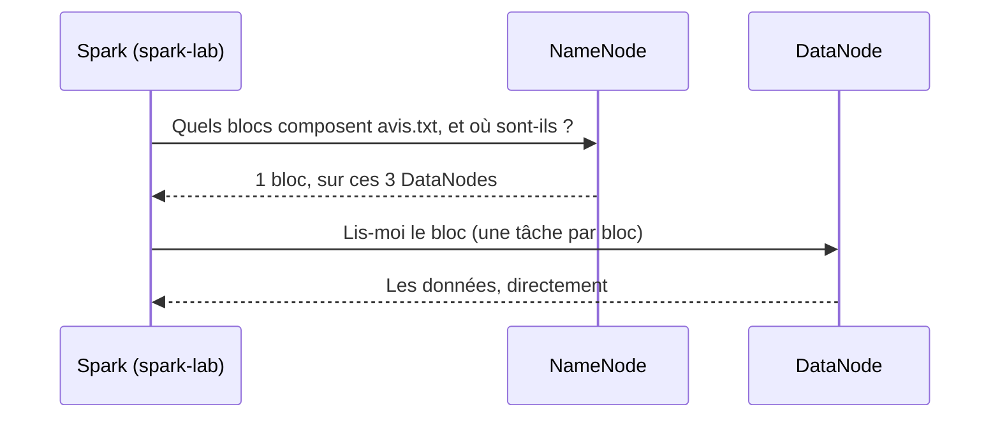

# TP : lire dans HDFS depuis PySpark

> Formation **PySpark – Traitement des données** · Jour 2 matin · Notion 2, « Charger des données depuis Hadoop »
> Document à refaire chez soi, étape par étape. Durée : 15 minutes environ.
> Prérequis : le [mini-cluster Hadoop du jour 1](../../j1-matin/hadoop-cluster/) et le conteneur `spark-lab` ([tutoriel du jour 1 après-midi](../../j1-apres-midi/spark-cluster/#3-étape-0--lenvironnement-spark-lab)) · [Retour au sommaire du dépôt](../../README.md)

Toutes les sorties de cette page sont **réelles**, erreurs comprises. Chez vous, les adresses `172.x.x.x` et les dates seront différentes.

## Sommaire

1. [Le chemin et le master](#1-le-chemin-et-le-master)
2. [Ce que fait Spark quand il lit HDFS](#2-ce-que-fait-spark-quand-il-lit-hdfs)
3. [Préparer les données](#3-préparer-les-données)
4. [Redémarrer le cluster Hadoop et attendre le NameNode](#4-redémarrer-le-cluster-hadoop-et-attendre-le-namenode)
5. [Relier spark-lab et déposer le fichier dans HDFS](#5-relier-spark-lab-et-déposer-le-fichier-dans-hdfs)
6. [Lire dans HDFS depuis le notebook](#6-lire-dans-hdfs-depuis-le-notebook)
7. [Nettoyer](#7-nettoyer)
8. [Dépannage](#8-dépannage)

---

## 1. Le chemin et le master

> **Le chemin dit OÙ SONT les données ; le master dit QUI CALCULE.**

Spark ne stocke rien : il lit et écrit là où sont les données. Pour changer de stockage, on change **le début de l'adresse**, jamais le reste du code.

| Adresse | Stockage |
|---|---|
| `data/avis.txt` | le disque local |
| `hdfs://namenode:8020/user/hadoop/j2/avis.txt` | HDFS |
| `s3a://mon-bucket/avis/avis.txt` | Amazon S3 |
| `abfss://conteneur@compte.dfs.core.windows.net/avis/avis.txt` | Azure Data Lake Storage (Fabric, Synapse) |

Un cluster Hadoop a **deux chefs**, pour deux systèmes indépendants :

| Système | Rôle | Chef | Comment Spark s'en sert |
|---|---|---|---|
| **HDFS** | **stocker** | NameNode (`namenode:8020`) | dans le **chemin** du fichier : `hdfs://namenode:8020/…` |
| **YARN** | **calculer** | ResourceManager | dans le **master** : `.master("yarn")` ou `--master yarn` |

Dans ce TP, on utilise **HDFS seul**, comme un disque partagé ; le calcul reste en `local[*]` dans `spark-lab`. Les deux choix sont indépendants :

| | Données locales (`data/…`) | Données dans HDFS (`hdfs://…`) |
|---|---|---|
| Calcul `local[*]` | lecture de fichiers locaux | **ce TP** |
| Calcul `spark://spark-master:7077` | le [cluster Standalone](../../j1-apres-midi/spark-cluster/) | possible |
| Calcul `yarn` | rare | la configuration classique en entreprise |

**Pourquoi pas `.master("yarn")` ici ?** Il faudrait la configuration Hadoop dans `spark-lab` (`HADOOP_CONF_DIR`, avec l'adresse du ResourceManager), et surtout un Python et un PySpark identiques dans les conteneurs YARN, que l'image `apache/hadoop:3` n'a pas. Sur un cluster d'entreprise (Cloudera, Amazon EMR, Microsoft Fabric), tout est déjà installé sur chaque machine : on écrit `--master yarn`, et rien d'autre ne change.

**L'analogie :** les données sont dans un entrepôt (HDFS), les ouvriers viennent d'une agence (le gestionnaire de calcul). Ici, on travaille **à la maison** (`local[*]`) en allant chercher les cartons à l'entrepôt. En entreprise, on embauche les ouvriers de l'agence **installée dans l'entrepôt** (YARN) : ils travaillent à côté des cartons.

---

## 2. Ce que fait Spark quand il lit HDFS



1. Spark demande au **NameNode** la liste des blocs du fichier et les DataNodes qui les possèdent.
2. Il crée **une tâche par bloc**, comme MapReduce créait un map par bloc.
3. Chaque tâche lit son bloc **directement sur un DataNode** : le NameNode donne les adresses, mais ne voit jamais passer les données.
4. Sur un vrai cluster, chaque tâche tourne de préférence **sur un DataNode qui possède son bloc** : c'est la **localité des données**. Dans ce TP, l'exécuteur tourne dans `spark-lab`, qui n'est pas un DataNode : le bloc traverse le réseau Docker.

---

## 3. Préparer les données

Le fichier `avis.txt` vient de la première notion du jour 2. Si vous ne l'avez pas, générez les trois fichiers du jour avec [`generer_donnees.py`](generer_donnees.py), **dans** `~/spark-lab` (le dossier `work` de JupyterLab) :

```bash
$ cp generer_donnees.py ~/spark-lab/
$ cd ~/spark-lab && python3 generer_donnees.py
Fichiers prêts : data/clients.csv (200), data/commandes.json (1000), data/avis.txt (300)
```

Le générateur est reproductible : tout le monde obtient exactement les mêmes fichiers. Les trois premières lignes de `data/avis.txt` :

```
2026-04-26|C158|5|Très bon produit
2026-05-02|C057|4|Conforme à la description
2026-06-28|C030|3|Service client réactif
```

---

## 4. Redémarrer le cluster Hadoop et attendre le NameNode

Dans le terminal **du poste** :

```bash
$ cd ~/hadoop-cluster          # ou le dossier j1-matin/hadoop-cluster du dépôt
$ docker compose up -d --scale datanode=3
$ until docker compose exec namenode hdfs dfsadmin -safemode wait 2>/dev/null; do sleep 3; done
$ docker compose exec namenode hdfs dfsadmin -report | grep -E "Live datanodes|Dead datanodes"
```

| Commande | Rôle |
|---|---|
| `docker compose up -d --scale datanode=3` | Redémarre les 6 conteneurs : NameNode, **3** DataNodes, ResourceManager, NodeManager. Sans `--scale datanode=3`, un seul DataNode. |
| `until … ; do sleep 3; done` | Réessaie toutes les 3 secondes jusqu'à ce que la commande réussisse. |
| `hdfs dfsadmin -safemode wait` | Attend la fin du **mode sans échec** du NameNode. |
| `hdfs dfsadmin -report \| grep …` | Le nombre de DataNodes vivants. |

**Pourquoi attendre, et deux fois ?**

1. **Le conteneur démarre avant le NameNode.** Le NameNode est une JVM qui met quelques secondes à ouvrir son port 8020. Une commande lancée trop tôt échoue, ce qui est arrivé lors de la préparation de ce TP, avec la commande `-safemode wait` seule :
   ```
   safemode: Call From namenode/172.27.0.3 to namenode:8020 failed on connection exception: java.net.ConnectException: Connection refused
   ```
2. **Le mode sans échec.** Au démarrage, le NameNode ne sait pas encore où sont les blocs : il attend le rapport de chaque DataNode. Jusque-là, HDFS est en **lecture seule**, et un `-mkdir` ou un `-put` échoue avec `SafeModeException: Name node is in safe mode`.

La boucle `until` règle les deux : elle réessaie tant que le NameNode refuse la connexion, puis attend la fin du mode sans échec.

Attendu :

```
[+] Running 6/6
 ✔ Container hadoop-cluster-namenode-1         Started
 ✔ Container hadoop-cluster-resourcemanager-1  Started
 ✔ Container hadoop-cluster-nodemanager-1      Started
 ✔ Container hadoop-cluster-datanode-1         Started
 ✔ Container hadoop-cluster-datanode-2         Started
 ✔ Container hadoop-cluster-datanode-3         Started
Live datanodes (3):
```

---

## 5. Relier spark-lab et déposer le fichier dans HDFS

```bash
$ docker compose exec namenode hdfs dfsadmin -safemode get
Safe mode is OFF
$ docker network connect hadoop-cluster_default spark-lab
$ docker exec spark-lab getent hosts namenode
172.27.0.3      namenode
$ docker cp ~/spark-lab/data/avis.txt hadoop-cluster-namenode-1:/tmp/avis.txt
Successfully copied 13.3kB to hadoop-cluster-namenode-1:/tmp/avis.txt
$ docker compose exec namenode hdfs dfs -mkdir -p /user/hadoop/j2
$ docker compose exec namenode hdfs dfs -put -f /tmp/avis.txt /user/hadoop/j2/
$ docker compose exec namenode hdfs dfs -ls /user/hadoop/j2
Found 1 items
-rw-r--r--   3 hadoop supergroup      11566 2026-10-05 15:38 /user/hadoop/j2/avis.txt
```

| Commande | Rôle |
|---|---|
| `docker network connect hadoop-cluster_default spark-lab` | `spark-lab` et le cluster sont sur deux réseaux Docker séparés : on ajoute à `spark-lab` une carte réseau sur celui du cluster. Muette quand elle réussit. |
| `getent hosts namenode` | Vérifie que le nom `namenode` existe désormais pour `spark-lab`. Sans lui, Spark échoue avec `UnknownHostException: namenode`. |
| `docker cp … :/tmp/avis.txt` | Copie le fichier sur le **disque local** du conteneur NameNode : un sas, pas encore HDFS. `13.3kB` est la taille de l'archive transférée, en-têtes compris. |
| `hdfs dfs -mkdir -p /user/hadoop/j2` | Crée le dossier **dans HDFS** ; `-p` crée les parents et ne proteste pas s'il existe. |
| `hdfs dfs -put -f /tmp/avis.txt /user/hadoop/j2/` | Envoie le fichier dans HDFS : le NameNode choisit 3 DataNodes pour chaque bloc. `-f` écrase un ancien fichier. |

Dans le `ls` : **`3`** est le facteur de réplication (`dfs.replication=3` du fichier `config`), `hadoop supergroup` le propriétaire, **`11566`** la taille en octets, soit un seul bloc (un bloc fait 128 Mo).

---

## 6. Lire dans HDFS depuis le notebook

Dans JupyterLab, dans un notebook du dossier `work` :

```python
# Cellule 1 : une session locale, sans rien sur Hadoop
from pyspark.sql import SparkSession
from pyspark.sql import functions as F

spark = SparkSession.builder.appName("Lire dans HDFS").getOrCreate()
print("Spark", spark.version)
```

```python
# Cellule 2 : le même spark.read.text qu'en local, seule l'adresse change
avis_hdfs = spark.read.text("hdfs://namenode:8020/user/hadoop/j2/avis.txt")
avis_hdfs.show(3, truncate=False)
print(avis_hdfs.count(), "avis lus dans HDFS")
print(avis_hdfs.rdd.getNumPartitions(), "partition(s)")
```

Attendu :

```
Spark 4.2.0
+-------------------------------------------+
|value                                      |
+-------------------------------------------+
|2026-04-26|C158|5|Très bon produit         |
|2026-05-02|C057|4|Conforme à la description|
|2026-06-28|C030|3|Service client réactif   |
+-------------------------------------------+
only showing top 3 rows
300 avis lus dans HDFS
1 partition(s)
```

- **Les mêmes lignes qu'en local** : même fichier, autre stockage, même code.
- **La `SparkSession` ne mentionne pas Hadoop** : c'est l'adresse `hdfs://namenode:8020/…` qui désigne le stockage.
- **1 partition** : 11 Ko tiennent dans un seul bloc HDFS, donc une seule tâche. Un fichier de 1 Go ferait 8 blocs, donc 8 partitions et 8 tâches en parallèle.
- Le `count` déclenche bien un job ; dans la Spark UI (`localhost:4040`), onglet **Stages**, la colonne **Input** montre les quelque 11 Ko lus depuis HDFS.

---

## 7. Nettoyer

```bash
$ docker network disconnect hadoop-cluster_default spark-lab
$ cd ~/hadoop-cluster && docker compose stop
```

`stop`, et non `down` : les conteneurs, et donc les fichiers stockés dans HDFS, sont conservés pour la prochaine fois.

---

## 8. Dépannage

| Symptôme | Cause | Remède |
|---|---|---|
| `Call From namenode/… to namenode:8020 failed … Connection refused`, juste après le `up -d` | La JVM du NameNode démarre encore | La boucle `until … ; do sleep 3; done` de la section 4 |
| `SafeModeException: Name node is in safe mode` au `-mkdir` ou au `-put` | Le NameNode fait l'inventaire des blocs | `docker compose exec namenode hdfs dfsadmin -safemode wait` |
| `getent hosts namenode` n'affiche rien | `spark-lab` n'est pas branché sur le réseau du cluster | `docker network connect hadoop-cluster_default spark-lab` |
| `UnknownHostException: namenode` dans le notebook | Même cause | Même remède |
| `Connection refused` dans le notebook, dès la `SparkSession` | Le noyau garde une session dont la JVM a disparu (après un redémarrage de `spark-lab`, par exemple) | **Kernel → Restart Kernel**, puis réexécuter la cellule 1 |
| `Live datanodes (1)` | Le cluster a été relancé sans `--scale datanode=3` | `docker compose up -d --scale datanode=3` |
| `File does not exist: /user/hadoop/j2/avis.txt` | Le `-put` n'a pas été fait, ou a échoué en mode sans échec | Refaire la section 5 |
